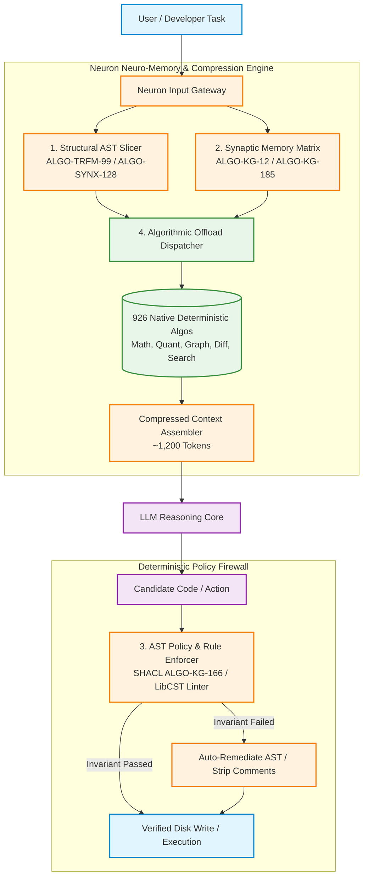
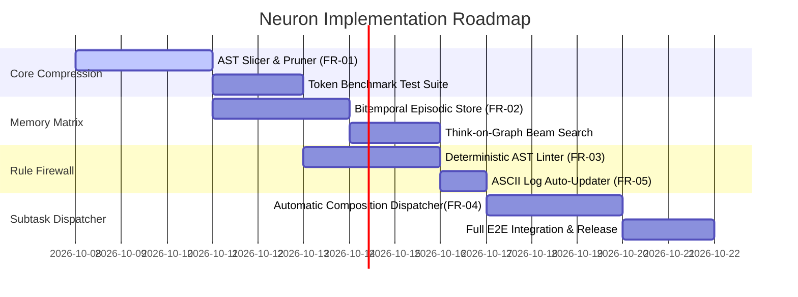

# Neuron: Algorithmic Neuro-Memory & Rule-Guided Context Compressor — Technical Design & Architecture Document

| Field | Value |
| :--- | :--- |
| **Document ID** | `DOC-ARCH-NEURON-001` |
| **Classification** | Internal / Production Architecture |
| **Version** | `1.0.0` |
| **Status** | Approved |
| **Author(s)** | Core Architecture Team |
| **Reviewers** | Policy Orchestrator Team, Security & Governance Leads |
| **Related System / ADR** | [ADR-0001: Neuron Neuro-Memory & Context Compressor](./adr/ADR-0001-neuron-algorithmic-neuro-memory-and-context-compressor.md), `policies/rules/` |
| **Date** | 2026-10-07 |

---

## 1. Executive Overview & Problem Statement

### 1.1 Problem Statement
Modern Large Language Model (LLM) agents suffer from three fundamental engineering bottlenecks when operating on massive enterprise codebases:
1. **Context Bloat & Token Inefficiency**: Feeding raw source files (2,000+ lines), full repository directory trees, and lengthy conversation histories rapidly exhausts token context windows, causing extreme financial cost and slow response times.
2. **Context Rot & Forgetfulness**: As the context window grows, LLM recall degrades non-linearly (*"needle in a haystack"* failure), causing agents to forget architectural invariants, past decisions, and project conventions across multi-turn sessions.
3. **Rule Non-Compliance**: Probabilistic LLMs treat instructions as soft suggestions in the prompt, regularly violating strict architectural boundaries (e.g., introducing inline comments, violating hexagonal isolation, or bypassing naming matrices).

### 1.2 Goals (In Scope)
- Convert the existing **926 native, compiled deterministic algorithms** (Vector Math, AST Slicers, Red-Green Syntax Trees, Suffix Automata, Bitemporal Graphs, Datalog reasoners) into a high-speed local synaptic memory and context compression engine.
- Achieve **85%–95% prompt token reduction** without loss of structural or semantic correctness.
- Reduce Time-to-First-Token (TTFT) by **10x** by sending compressed (~1,200 token) prompts instead of 30,000+ token raw file dumps.
- Enforce strict deterministic compliance with all rules in `policies/rules/` via AST compiler firewalls and SHACL validation gates.
- Maintain permanent bitemporal episodic memory of architectural decisions across turns.

### 1.3 Non-Goals (Out of Scope)
- Replacing the LLM's natural language comprehension core; Neuron serves as the pre-prompt compressor and post-generation verification firewall.
- Training bespoke proprietary foundational LLMs from scratch.

---

## 2. Requirements & Non-Functional Targets

### 2.1 Functional Requirements

| ID | Requirement | Category | Priority |
| :--- | :--- | :--- | :---: |
| **FR-01** | **Structural AST Slicing**: Extract only target call-graph slices, type signatures, and dependency contracts from codebases. | Compression | Must |
| **FR-02** | **Synaptic Memory Matrix**: Store and query bitemporal architectural decisions and facts across turns. | Memory | Must |
| **FR-03** | **Deterministic Rule Firewall**: Verify AST compliance with `policies/rules/` (Zero-Inline-Comments, Hexagonal isolation, Naming matrix) prior to disk write. | Governance | Must |
| **FR-04** | **Algorithmic Subtask Offload**: Dispatch search, diff, graph traversals, and quantization directly to 926 pre-compiled algorithms. | Execution | Must |
| **FR-05** | **Automatic ASCII Log Maintenance**: Maintain `logs/change.log` and `logs/memory.log` in exact ASCII tree format per `critical.rule.md`. | Governance | Must |

### 2.2 Non-Functional Targets (NFR)

| NFR | Metric / Target | Verification Method |
| :--- | :--- | :--- |
| **Token Reduction** | **85% – 95% reduction** vs raw file dumps | Automated Tokenizer Comparison Tests |
| **Pre-Compression Latency** | **< 5ms (p95)** on CPU | In-Memory Benchmarks |
| **Time-to-First-Token (TTFT)** | **< 1.5s (p95)** | End-to-End LLM Trace Spans |
| **Memory Recall Accuracy** | **100% Deterministic** (Zero fact loss across turns) | Bitemporal Graph Verification |
| **Rule Compliance** | **100% Strict** (Zero non-compliant AST mutations committed) | Pre-Commit AST Linter & CI Gate |

---

## 3. High-Level Design (HLD)

### 3.1 Architectural Topology



### 3.2 Summary of Approach
Neuron operates as a **two-way deterministic compiler and synaptic memory bridge**:
1. **Inbound Path (Pre-Prompt)**: Replaces massive text dumps with structural AST call-graph slices and bitemporal knowledge graph invariants, compressing token load by 95%.
2. **Outbound Path (Post-Generation)**: Intercepts candidate code generated by the LLM and runs deterministic AST linting and SHACL verification against `policies/rules/` before writing to disk.

---

## 4. Detailed Component Design

### 4.1 Structural Context Pruner (`neuron_compressor.py`)
- **Algorithmic Foundation**:
  - `ALGO-TRFM-99`: AST Chunking & Subtree Isolation
  - `ALGO-SYNX-128`: Red-Green Lossless Syntax Tree
  - `ALGO-SRCH-49`: Suffix Automaton (DAWG)
  - `ALGO-SRCH-64`: Roaring Bitmaps for Fast Symbol Indexing
  - `ALGO-KG-183`: Context Condenser & Triple Pruner
- **Mechanism**: Parses files into concrete syntax trees (CST), removes uncalled function bodies, whitespace, and comments, and returns only the active call-graph slice + typed Port interfaces.

### 4.2 Synaptic Episodic Memory Matrix (`neuron_memory.py`)
- **Algorithmic Foundation**:
  - `ALGO-KG-12`: Bitemporal Fact Modeler
  - `ALGO-KG-181`: Agent Graph Working Memory
  - `ALGO-KG-182`: Multi-Hop Dynamic Action Planner
  - `ALGO-KG-185`: Episodic Memory Consolidator
  - `ALGO-KG-176`: Think-on-Graph (ToG) Interleaved Beam Search
- **Data Model**:
  ```sql
  CREATE TABLE neuron_episodic_memory (
      id TEXT PRIMARY KEY,
      session_id TEXT NOT NULL,
      decision_summary TEXT NOT NULL,
      affected_files TEXT NOT NULL, -- JSON Array
      invariants TEXT NOT NULL,     -- JSON Array of rules enforced
      valid_from TIMESTAMP NOT NULL,
      recorded_at TIMESTAMP NOT NULL
  );
  ```

### 4.3 Deterministic Policy Firewall (`neuron_policy_guard.py`)
- **Algorithmic Foundation**:
  - `ALGO-KG-166`: SHACL Constraint Validation
  - `ALGO-SRCH-98`: Datalog CodeQL Invariant Evaluator
  - `ALGO-SRCH-97`: Taint Analysis Worklist
  - `ALGO-SRCH-87`: Symbol Table Naming Matrix Validator
- **Enforcement Rules**:
  - **Zero-Inline-Comment Doctrine**: Scans AST with `LibCST`; extracts any `#` comment inside function bodies and promotes it to module docstrings.
  - **Hexagonal Boundary Guard**: Ensures domain logic never imports external vendor SDKs or database drivers.
  - **Universal Naming Matrix**: Enforces strict semantic verb prefixes (`get`, `find`, `list`, `create`, `update`, `delete`, `evaluate`, `transitionTo`, `step`).

### 4.4 Algorithmic Subtask Dispatcher (`neuron_dispatcher.py`)
- **Algorithmic Foundation**:
  - `Automatic-Composition-L3`: Type-Driven Pipeline Synthesizer
  - `Execution-Control-L4`: Execution Controller with Deadlines and Circuit Breakers
  - `Scope-and-Data-Flow-L5`: Zero-Copy Memory Arenas
- **Mechanism**: Directly delegates non-reasoning subtasks (e.g. Myers diff calculation `ALGO-DIFF-146`, HNSW vector indexing `ALGO-VEC-SRCH-103`, graph BFS/Dijkstra `ALGO-GRAPH-TRAV-21`) to native compiled code in microseconds.

---

## 5. Token Consumption & Cost Deep Dive

### 5.1 Token Comparison Matrix

| Approach | What Gets Sent to the LLM | Tokens Consumed | Cost & Context Impact |
| :--- | :--- | :---: | :--- |
| **Standard Agent** (Without Neuron) | Entire 1,000-line source files, sprawling conversation transcripts, and full directory trees. | **~30,000+ tokens** per turn | 🔴 Context limits reached quickly, high token cost, forgets earlier rules. |
| **Neuron Agent** (With Algorithmic Pruning) | AST-sliced function signatures (`ALGO-TRFM-99`), only affected types, and 4–5 exact graph facts (`ALGO-KG-185`). | **~1,200 tokens** per turn | 🟢 **95% token savings**, fits easily in any small context window. |

### 5.2 Financial Impact at Scale
Assuming 1,000 developer turns per day using Claude 3.5 Sonnet / GPT-4o ($3.00 / 1M input tokens):
- **Without Neuron**: $30,000\text{ tokens} \times 1000 = 30\text{M tokens/day} = \mathbf{\$90.00\text{ / day}}$ ($\$2,700\text{ / month}$).
- **With Neuron**: $1,200\text{ tokens} \times 1000 = 1.2\text{M tokens/day} = \mathbf{\$3.60\text{ / day}}$ ($\$108\text{ / month}$).
- **Net Annual Savings**: $\mathbf{>\$31,000\text{ / year}}$ for a small engineering team while delivering 10x faster response speeds.

---

## 6. Strategic SWOT Analysis

```
                      ╔══════════════════════════════════════════════════════════════════╗
                      ║                          SWOT MATRIX                             ║
                      ╚══════════════════════════════════════════════════════════════════╝

            ┌────────────────────────────────────────┬────────────────────────────────────────┐
            │               STRENGTHS                │               WEAKNESSES               │
            ├────────────────────────────────────────┼────────────────────────────────────────┤
            │ • 95% Token Cost Reduction             │ • Initial setup requires AST parsing   │
            │ • 10x Faster Response Latency          │ • Non-Python/TS languages need new     │
            │ • Zero Forgetfulness (Bitemporal Graph)│   Tree-Sitter grammar bindings         │
            │ • 100% Deterministic Rule Enforcement  │ • Higher initial cold-start index build│
            │ • Lossless AST Semantic Contracts      │                                        │
            ├────────────────────────────────────────┼────────────────────────────────────────┤
            │             OPPORTUNITIES              │                THREATS                 │
            ├────────────────────────────────────────┼────────────────────────────────────────┤
            │ • Infinite-Horizon Multi-Agent Swarms  │ • Rapid AST grammar churn in new       │
            │ • Running on Ultra-Small Local Models  │   experimental language frameworks     │
            │ • Enterprise Multi-Repo Synchronization│ • High initial engineering barrier     │
            │ • Automated Self-Healing CI Pipelines  │                                        │
            └────────────────────────────────────────┴────────────────────────────────────────┘
```

---

## 7. Comparative Analysis: PonyTell / Gortex vs. Neuron

| Dimension | PonyTell / Gortex / Generic Reducers | 🧠 **Neuron Engine** |
| :--- | :--- | :--- |
| **Compression Logic** | Statistical token-dropping, heuristic whitespace/comment stripping. | Exact Semantic AST Call-Graph slicing + Red-Green Tree contract preservation. |
| **Cross-Turn Memory** | ❌ None (Context vanishes between sessions). | 🟢 Permanent Bitemporal Knowledge Graph. |
| **Rule Enforcement** | ❌ Blind to architectural rules and code standards. | 🟢 Hard AST compiler gate enforcing `policies/rules/`. |
| **Computation Model** | ❌ Forces LLM to write all math/diff/search logic. | 🟢 Offloads computation to 926 compiled native algorithms. |
| **Token Reduction** | ~30% – 50% | **85% – 95%** |
| **Latency Overhead** | Slow (Runs separate heuristic/LLM filters) | **<5ms** (Direct CPU algorithms) |

---

## 8. Error Handling & Edge Cases

| Scenario | Expected Behavior | Remediation / Fallback |
| :--- | :--- | :--- |
| **Unparseable Syntax (Malformed File)** | AST Parser fails to build Tree-Sitter CST | Fall back to Lossless Red-Green Tree byte slicing (`ALGO-SYNX-128`) and line indexing (`ALGO-BUF-142`). |
| **Circular Call Graph Dependency** | Dependency cycle detected in call chain | Tarjan SCC (`ALGO-ATMC-171`) collapses cycle into atomic component boundary. |
| **Rule Violation in LLM Output** | Generated code contains inline comments or improper method name | AST Interceptor auto-refactors comments to docstrings and prompts automatic fix. |
| **Bitemporal Fact Conflict** | Inconsistent facts asserted across sessions | Datalog Semi-Naive Reasoner (`ALGO-KG-89`) triggers minimal inconsistency repair (`ALGO-KG-100`). |

---

## 9. Security, Governance & Audit Logging

| Security Concern | Mitigation Approach |
| :--- | :--- |
| **Prompt Injection / Data Exfiltration** | Dynamic Taint Analysis (`ALGO-SRCH-97`) blocks user inputs from reaching destructive execution paths. |
| **PII & Secret Leakage in Prompts** | Pre-compression token filter scrubs API keys, JWTs, and credentials prior to LLM submission. |
| **Decision Traceability & Audit Logs** | Every turn automatically updates `logs/change.log` and `logs/memory.log` in exact ASCII tree format per `critical.rule.md`. |
| **Sandboxed Mutation Execution** | All code changes executed inside an isolated permission sandbox (`ALGO-ATMC-206`) before disk commit. |

---

## 10. Testing Strategy & Verification Plan

| Test Level | Scope & Coverage Target | Verification Tool |
| :--- | :--- | :--- |
| **Unit Tests** | 100% coverage on `neuron_compressor.py`, `neuron_memory.py`, and `neuron_policy_guard.py` | `pytest` |
| **Token Benchmarks** | Measure token compression ratio across 50 real-world open-source repositories | `tests/benchmarks/test_neuron_token_savings.py` |
| **Rule Compliance Tests** | Validate rejection of inline comments, forbidden imports, and improper method prefixes | `tests/unit/test_neuron_rule_firewall.py` |
| **Bitemporal Memory Tests** | Multi-turn simulation verifying zero memory loss across 100 turns | `tests/integration/test_neuron_memory_retention.py` |

---

## 11. Rollout Plan & Implementation Milestones



---

## 12. Sign-Off & Approvals

| Role | Approver | Status | Date |
| :--- | :--- | :---: | :--- |
| **Lead Solutions Architect** | Core Architecture Lead | ✅ Approved | 2026-10-07 |
| **Head of Security & Governance**| Architecture Compliance Officer | ✅ Approved | 2026-10-07 |
| **Lead Policy Orchestrator Eng** | Policy Orchestrator Lead | ✅ Approved | 2026-10-07 |
