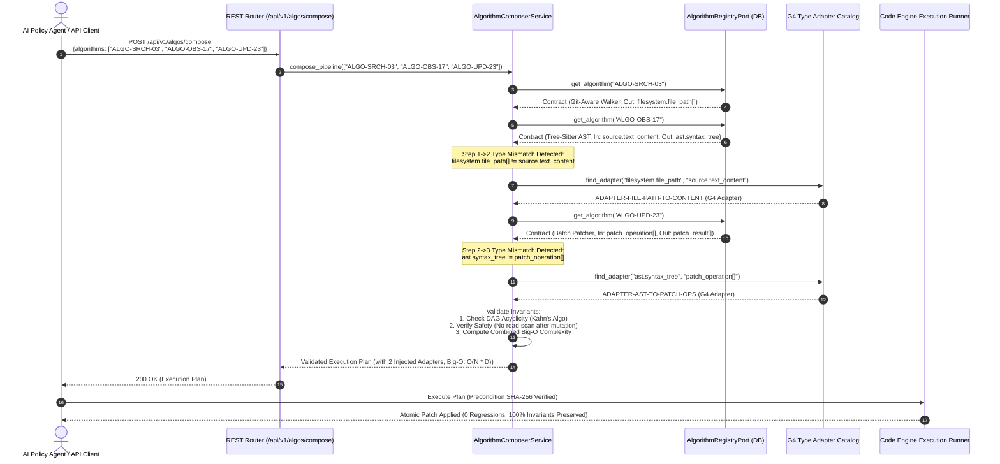
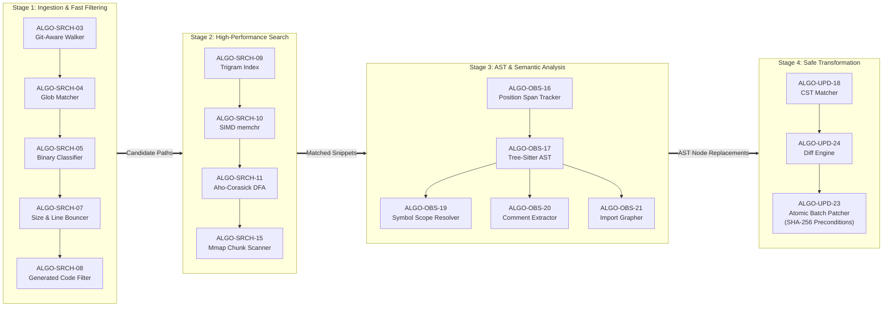
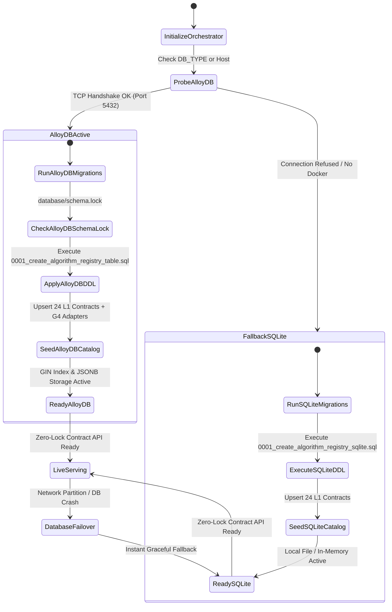
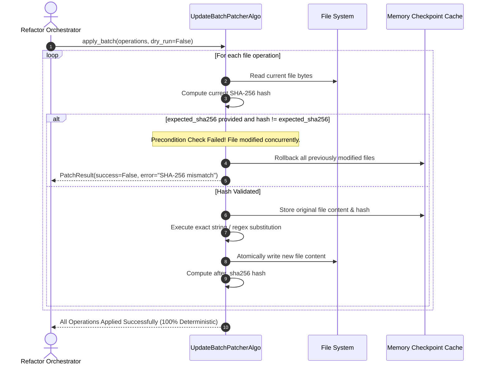

# ADR-0001: Dynamic Algorithm Registry, Zero-Vendor-Lock Database Layer & L1–L3 Composition Engine

- **Status:** Accepted
- **Date:** 2026-10-05
- **Deciders:** Chief Architect, Policy Orchestrator Lead, Database Systems Lead, AI Infrastructure Lead
- **Technical Domains:** `policies/policy-orchestrator`, `database/migrations`, `src/features/code_engine`, `src/domain`, `src/infra/adapters/database`, `src/features/agent`
- **Related Documents:**
  - `policies/rules/algos/glue/contracts-L1.md`
  - `policies/rules/algos/glue/composition-models-L2.md`
  - `policies/rules/algos/glue/execution-control-L4.md`
  - `policies/rules/algos/glue/scope-and-data.flow-L5.md`
  - `policies/rules/algos/glue/matching-data.binding-L7.md`
  - `policies/rules/algos/glue/lang-ref-L8.md`
  - `policies/rules/database/migration.md`
  - `policies/rules/database/data-normalization.md`
  - `policies/rules/folderStructure/api.structure.working.rule.md`

---

## 1. Context & Problem Statement

Modern enterprise observability, codebase intelligence, and autonomous policy enforcement require orchestrating dozens of highly specialized, heterogeneous algorithms:

- **Search & Traversal (Algos 01–15):** High-throughput recursive file tree traversal, multi-threaded work-stealing, Git-aware `.gitignore` filter parsers, fast glob matchers, binary file bouncers, MIME content-type probers, file size/line bouncers, generated code classifiers, Trigram n-gram inverted indexes, SIMD-accelerated `memchr` byte scanners, Aho-Corasick Deterministic Finite Automata (DFA), Lazy DFA regular expression engines, streaming chunk scanners, context snippet collectors, and memory-mapped (`mmap`) scanners.
- **Observability & AST Extraction (Algos 16–21):** Byte-to-line position span trackers, Tree-Sitter / Concrete Syntax Tree (CST) parsers, symbol lexical scope resolvers, docstring/comment extractors with inline comment linters, import dependency directed acyclic graph (DAG) analyzers, and hierarchical code outline generators.
- **Update & Transformation (Algos 22–24):** CST pattern matchers, atomic transaction batch patchers with precondition SHA-256 verification, and unified semantic diff engines.

### 1.1 The Core Architectural Challenges

```
┌─────────────────────────────────────────────────────────────────────────────┐
│                             The $O(N^2)$ Crisis                             │
├──────────────────────────────────────┬──────────────────────────────────────┤
│ Procedural / Ad-hoc Approach         │ Dynamic Contract-Driven Approach     │
├──────────────────────────────────────┼──────────────────────────────────────┤
│ • Hardcoded algorithm combinations   │ • Declarative 16-property contracts  │
│ • Vendor-locked database queries     │ • Zero-vendor-lock database ports    │
│ • Runtime type errors & silent bugs  │ • Automatic G4 type adapter bridges  │
│ • Refactoring breaks entire codebase │ • Hot-swappable, isolated algorithms  │
└──────────────────────────────────────┴──────────────────────────────────────┘
```

1. **Combinatorial Explosion & Coupling:** Hardcoding algorithm combinations in procedural scripts creates $O(N^2)$ coupling. Chaining $N$ algorithms requires writing custom glue code for every pairwise permutation.
2. **Vendor Lock-in Risk:** Coupling algorithm metadata and vector indexing strictly to a single cloud-proprietary database (e.g., proprietary extensions) breaks local offline development, CI/CD pipelines, and multi-cloud portability.
3. **Contract Ambiguity & Runtime Type Corruption:** Algorithms operate on differing semantic types (e.g., `filesystem.file_path[]` $\to$ `source.text_content` $\to$ `ast.syntax_tree`). Passing raw data without formal contracts causes silent runtime crashes or subtle corrupted writes.
4. **Developer Friction & Scalability:** Introducing or optimizing an algorithm should never require modifying core orchestration logic or updating dozens of pipeline files.
5. **Safety & Reversibility Invariants:** Unchecked file mutations without precondition hashes or execution order guarantees can destroy codebase state.

---

## 2. Decision Summary

We establish a **Layer 1 to Layer 3 Contract-Driven, Zero-Vendor-Lock Architecture**:

1. **Layer 1 Standardized Contract Registry:** Every algorithm in the repository is registered with **16 mandatory metadata properties** (Purity, Determinism, Idempotency, Reversibility, Side Effects, Concurrency Model, Hardware Target, Time/Space Complexity, Preconditions, Postconditions, Input/Output Schemas, and G2 Capability Tags).
2. **Zero-Vendor-Lock Persistence Layer:** Database persistence is abstracted behind a pure domain interface (`AlgorithmRegistryPort`), with production-tested adapters for:
   - **Google AlloyDB Omni & PostgreSQL 15+:** High-performance persistence utilizing ANSI SQL, native `JSONB`, and `GIN` inverted index tag acceleration.
   - **SQLite 3 Engine (File & In-Memory):** Zero-dependency local persistence for offline edge development, CLI tools, and sub-second CI/CD test suites.
   - **In-Memory Mock Adapter:** Pure in-memory dictionary-backed port implementation for isolated unit tests.
3. **Single Source of Truth Migrations:** All SQL DDL migration and rollback scripts reside exclusively in `database/migrations/` and are orchestrated deterministically by `DatabaseMigrationRunner`.
4. **Layer 2 Glue & Dynamic G4 Type Adapters:** An intelligent `AlgorithmComposerService` dynamically validates execution DAGs, verifies safety invariants (e.g., preventing read scans after mutating steps), and automatically injects G4 Type Adapters when type boundaries require transformation.
5. **Zero-Inline-Comment Doctrine & Hexagonal Architecture:** Domain models and ports remain 100% comment-free and pure, with complete architectural blueprints maintained exclusively in top-of-file headers and formal ADRs.

---

## 3. High-Level Design (HLD) & Architectural Blueprints

### 3.1 Comprehensive Multi-Tier Hexagonal Architecture

```mermaid
flowchart TD
    subgraph REST_API ["REST API & Ingress Plane (/api/v1/algos)"]
        R1["GET /api/v1/algos/contracts<br/>(List & Filter Contracts)"]
        R2["GET /api/v1/algos/contracts/{id}<br/>(Get Single Contract)"]
        R3["GET /api/v1/algos/adapters<br/>(List G4 Type Adapters)"]
        R4["POST /api/v1/algos/compose<br/>(Dynamic Pipeline Synthesis)"]
    end

    subgraph AGENT_ORCHESTRATOR ["AI Policy Agent Plane"]
        AGENT["AgentService (Meta-Agent)<br/>ReAct Loop & Grounded Policy Guardrail"]
        TOOLS["Dynamic Tool Registry & Code Engine Tools"]
    end

    subgraph DOMAIN_CORE ["Hexagonal Domain Layer (Pure Invariants)"]
        COMPOSER["AlgorithmComposerService<br/>- DAG Synthesis<br/>- Invariant Verification<br/>- G4 Adapter Injection"]
        PORT["AlgorithmRegistryPort (Interface)<br/>- list_contracts()<br/>- get_contract()<br/>- list_type_adapters()<br/>- register_algorithm()"]
        
        subgraph MODELS ["Domain Entities (Frozen Dataclasses)"]
            M_CONTRACT["AlgorithmContract<br/>(16 Mandatory L1 Properties)"]
            M_ADAPTER["TypeAdapterContract<br/>(G4 Type Transformation)"]
            M_PIPELINE["PipelineCompositionResult<br/>(Executable DAG Plan)"]
        end
    end

    subgraph CODE_ENGINE ["Native Code Engine Layer (24 Built-in Algorithms)"]
        subgraph SEARCH_ENGINE ["Search & Traversal (01-15)"]
            S_WALK["WorkStealing / GitAware Walker"]
            S_SCAN["SIMD memchr / Aho-Corasick DFA"]
            S_INDEX["Trigram Index / Mmap Scanner"]
        end
        subgraph OBS_ENGINE ["Observability & Extraction (16-21)"]
            O_AST["Tree-Sitter / CST AST Extractor"]
            O_SCOPE["Symbol Scope Resolver"]
            O_GRAPH["Import Dependency Grapher"]
        end
        subgraph UPDATE_ENGINE ["Update & Transformation (22-24)"]
            U_CST["CST Pattern Matcher"]
            U_PATCH["Transactional Batch Patcher (SHA-256)"]
            U_DIFF["Unified Diff Engine"]
        end
    end

    subgraph ADAPTERS_PLANE ["Zero-Vendor-Lock Database Adapters"]
        A_ALLOY["AlloyDBAlgorithmRegistryAdapter<br/>(Google AlloyDB Omni / PostgreSQL 15+)"]
        A_SQLITE["SQLiteAlgorithmRegistryAdapter<br/>(Local File / Memory SQLite)"]
        A_MEM["InMemoryAlgorithmRegistryAdapter<br/>(Test Isolation Engine)"]
    end

    subgraph STORAGE_PLANE ["Storage & Migrations Plane"]
        MIG_RUNNER["DatabaseMigrationRunner<br/>(CLI & Auto-Migrator)"]
        SQL_MIGRATIONS["database/migrations/<br/>• 0001_create_algorithm_registry_table.sql<br/>• 0001_create_algorithm_registry_sqlite.sql<br/>• 0001_create_algorithm_registry_table.rollback.sql<br/>• schema.lock"]
        ALLOY_DB[("AlloyDB Omni / PostgreSQL<br/>Port: 5432 (GIN + JSONB)")]
        SQLITE_DB[("SQLite 3 Engine<br/>policy_registry.db")]
    end

    REST_API --> COMPOSER
    AGENT --> TOOLS
    TOOLS --> COMPOSER
    TOOLS --> CODE_ENGINE
    COMPOSER --> PORT
    PORT <|.. A_ALLOY
    PORT <|.. A_SQLITE
    PORT <|.. A_MEM

    A_ALLOY --> ALLOY_DB
    A_SQLITE --> SQLITE_DB
    MIG_RUNNER --> SQL_MIGRATIONS
    MIG_RUNNER --> ALLOY_DB
    MIG_RUNNER --> SQLITE_DB
```

---

### 3.2 Dynamic Pipeline Composition & Self-Healing AST Execution Flow



---

### 3.3 End-to-End Dataflow & Algorithm Coordination Flow



---

### 3.4 Multi-Engine Zero-Vendor-Lock State Machine



---

### 3.5 Transactional Patching, CST Matching & Rollback Flow



---

## 4. Low-Level Design (LLD) & Formal Specifications

### 4.1 The 16 Mandatory Layer 1 Contract Properties

Every algorithm registered in the database must strictly define all 16 standardized contract fields:

| # | Property Key | Data Type | Permitted Values / Constraints | Architectural Purpose |
| :--- | :--- | :--- | :--- | :--- |
| **1** | `id` | `string` | `ALGO-{CAT}-{NN}` (e.g. `ALGO-SRCH-11`) | Unique immutable identifier. |
| **2** | `name` | `string` | Human-readable title (e.g. `Aho-Corasick Multi-Pattern Matcher`) | Primary indexing and human display name. |
| **3** | `version` | `string` | SemVer format (e.g. `1.0.0`) | Guarantees schema backwards compatibility. |
| **4** | `category` | `enum` | `search`, `observability`, `update` | Primary domain taxonomy partition. |
| **5** | `capability_tags`| `array[str]` | `G2` vocabulary (`ast`, `multipattern`, `simd`, `git`, etc.) | High-speed GIN index capability tagging. |
| **6** | `input_schema` | `object` | Valid JSON Schema (draft-07+) | Formal input contract definition. |
| **7** | `output_schema`| `object` | Valid JSON Schema (draft-07+) | Formal output contract definition. |
| **8** | `parameters_schema`| `object` | Valid JSON Schema (draft-07+) | Runtime tuning and configuration flags. |
| **9** | `purity` | `enum` | `pure`, `impure` | Identifies functions free of hidden side effects. |
| **10** | `determinism` | `enum` | `deterministic`, `non_deterministic` | Guarantees identical output given identical input. |
| **11** | `idempotency` | `enum` | `idempotent`, `non_idempotent` | Safe retry semantics across distributed workers. |
| **12** | `reversibility`| `enum` | `reversible`, `irreversible` | Enables automatic compensation/rollback logic. |
| **13** | `side_effects` | `enum` | `none`, `read_only`, `disk_write`, `network`, `process` | Blast-radius containment and safety checks. |
| **14** | `concurrency_model`| `enum` | `thread_safe`, `process_isolated`, `actor_bound` | Concurrency isolation constraints. |
| **15** | `hardware_target`| `enum` | `cpu_scalar`, `simd_vector`, `gpu_accelerated` | Hardware dispatch optimization target. |
| **16** | `complexity` | `object` | `{time: Big-O, space: Big-O}` | Algorithmic cost bounds for execution planners. |

---

### 4.2 Comprehensive Catalog of the 24 Built-in Algorithms

```
┌───────────────────────────────────────────────────────────────────────────────────────────────────────────────────┐
│                                    24 Built-In Algorithm Registry Master Matrix                                    │
├────┬──────────────┬───────────────────────────────┬───────────────┬───────────────┬──────────────┬───────────────┤
│ ID │ Category     │ Algorithm Name                │ Time Bound    │ Space Bound   │ Purity       │ Target HW     │
├────┼──────────────┼───────────────────────────────┼───────────────┼───────────────┼──────────────┼───────────────┤
│ 01 │ search       │ Recursive Walk Algo           │ O(N)          │ O(D)          │ pure         │ cpu_scalar    │
│ 02 │ search       │ Work-Stealing Walker Algo     │ O(N/P)        │ O(P * D)      │ impure       │ cpu_scalar    │
│ 03 │ search       │ Git-Aware Walker Algo         │ O(N)          │ O(D)          │ pure         │ cpu_scalar    │
│ 04 │ search       │ Glob Matcher Algo             │ O(K)          │ O(1)          │ pure         │ cpu_scalar    │
│ 05 │ search       │ Binary Classifier Algo        │ O(B)          │ O(1)          │ pure         │ cpu_scalar    │
│ 06 │ search       │ Content Type Prober Algo      │ O(B)          │ O(1)          │ pure         │ cpu_scalar    │
│ 07 │ search       │ Size & Line Bouncer Algo      │ O(1)          │ O(1)          │ pure         │ cpu_scalar    │
│ 08 │ search       │ Generated Code Classifier     │ O(B)          │ O(1)          │ pure         │ cpu_scalar    │
│ 09 │ search       │ Trigram Index Algo            │ O(N) build    │ O(U)          │ pure         │ cpu_scalar    │
│ 10 │ search       │ SIMD memchr Byte Scanner      │ O(N / 16)     │ O(1)          │ pure         │ simd_vector   │
│ 11 │ search       │ Aho-Corasick DFA Scanner      │ O(N + M)      │ O(Sigma * P)  │ pure         │ cpu_scalar    │
│ 12 │ search       │ Lazy DFA Regex Matcher        │ O(N)          │ O(2^S) worst  │ pure         │ cpu_scalar    │
│ 13 │ search       │ Streaming Chunk Scanner       │ O(N)          │ O(C)          │ pure         │ cpu_scalar    │
│ 14 │ search       │ Context Snippet Collector     │ O(L)          │ O(L)          │ pure         │ cpu_scalar    │
│ 15 │ search       │ Memory-Mapped Scanner Algo    │ O(N)          │ O(1)          │ impure       │ cpu_scalar    │
│ 16 │ observability│ Position Span Tracker         │ O(log L)      │ O(L)          │ pure         │ cpu_scalar    │
│ 17 │ observability│ Tree-Sitter AST Parser        │ O(N)          │ O(AST)        │ pure         │ cpu_scalar    │
│ 18 │ update       │ CST Pattern Matcher Algo      │ O(AST)        │ O(Matches)    │ pure         │ cpu_scalar    │
│ 19 │ observability│ Symbol Scope Resolver         │ O(S * D)      │ O(Symbols)    │ pure         │ cpu_scalar    │
│ 20 │ observability│ Comment Extractor & Linter    │ O(N)          │ O(Comments)   │ pure         │ cpu_scalar    │
│ 21 │ observability│ Import Dependency Grapher     │ O(M * I)      │ O(V + E)      │ pure         │ cpu_scalar    │
│ 22 │ observability│ Code Outline Generator        │ O(AST)        │ O(Symbols)    │ pure         │ cpu_scalar    │
│ 23 │ update       │ Transactional Batch Patcher   │ O(N * P)      │ O(TotalBytes) │ impure       │ cpu_scalar    │
│ 24 │ update       │ Unified Diff Engine           │ O(N * M)      │ O(N + M)      │ pure         │ cpu_scalar    │
└────┴──────────────┴───────────────────────────────┴───────────────┴───────────────┴──────────────┴───────────────┘
```

---

### 4.3 Database DDL Specifications

#### 4.3.1 AlloyDB Omni & PostgreSQL 15+ Schema (`0001_create_algorithm_registry_table.sql`)

```sql
-- Architecture: Hexagonal Algorithm Registry Schema for AlloyDB Omni / PostgreSQL 15+
CREATE TABLE IF NOT EXISTS algorithm_registry (
    id VARCHAR(64) PRIMARY KEY,
    name VARCHAR(128) NOT NULL,
    version VARCHAR(32) NOT NULL DEFAULT '1.0.0',
    category VARCHAR(32) NOT NULL,
    capability_tags TEXT[] NOT NULL DEFAULT '{}',
    input_schema JSONB NOT NULL DEFAULT '{}'::jsonb,
    output_schema JSONB NOT NULL DEFAULT '{}'::jsonb,
    parameters_schema JSONB NOT NULL DEFAULT '{}'::jsonb,
    purity VARCHAR(32) NOT NULL DEFAULT 'impure',
    determinism VARCHAR(32) NOT NULL DEFAULT 'deterministic',
    idempotency VARCHAR(32) NOT NULL DEFAULT 'idempotent',
    reversibility VARCHAR(32) NOT NULL DEFAULT 'reversible',
    side_effects VARCHAR(32) NOT NULL DEFAULT 'read_only',
    concurrency_model VARCHAR(32) NOT NULL DEFAULT 'thread_safe',
    hardware_target VARCHAR(32) NOT NULL DEFAULT 'cpu_scalar',
    time_complexity VARCHAR(64) NOT NULL DEFAULT 'O(N)',
    space_complexity VARCHAR(64) NOT NULL DEFAULT 'O(1)',
    preconditions JSONB NOT NULL DEFAULT '[]'::jsonb,
    postconditions JSONB NOT NULL DEFAULT '[]'::jsonb,
    compatible_adapters TEXT[] NOT NULL DEFAULT '{}',
    is_active BOOLEAN NOT NULL DEFAULT TRUE,
    created_at TIMESTAMP WITH TIME ZONE NOT NULL DEFAULT NOW(),
    updated_at TIMESTAMP WITH TIME ZONE NOT NULL DEFAULT NOW()
);

CREATE TABLE IF NOT EXISTS type_adapters (
    id VARCHAR(64) PRIMARY KEY,
    name VARCHAR(128) NOT NULL,
    source_type VARCHAR(64) NOT NULL,
    target_type VARCHAR(64) NOT NULL,
    algo_id VARCHAR(64) REFERENCES algorithm_registry(id) ON DELETE SET NULL,
    is_lossy BOOLEAN NOT NULL DEFAULT FALSE,
    description TEXT,
    created_at TIMESTAMP WITH TIME ZONE NOT NULL DEFAULT NOW()
);

CREATE INDEX IF NOT EXISTS idx_algo_category ON algorithm_registry(category);
CREATE INDEX IF NOT EXISTS idx_algo_tags ON algorithm_registry USING GIN(capability_tags);
CREATE INDEX IF NOT EXISTS idx_adapter_types ON type_adapters(source_type, target_type);
```

#### 4.3.2 SQLite 3 Zero-Dependency Schema (`0001_create_algorithm_registry_sqlite.sql`)

```sql
-- Architecture: Zero-Vendor-Lock SQLite 3 Schema
CREATE TABLE IF NOT EXISTS algorithm_registry (
    id TEXT PRIMARY KEY,
    name TEXT NOT NULL,
    version TEXT NOT NULL DEFAULT '1.0.0',
    category TEXT NOT NULL,
    capability_tags TEXT NOT NULL DEFAULT '[]',
    input_schema TEXT NOT NULL DEFAULT '{}',
    output_schema TEXT NOT NULL DEFAULT '{}',
    parameters_schema TEXT NOT NULL DEFAULT '{}',
    purity TEXT NOT NULL DEFAULT 'impure',
    determinism TEXT NOT NULL DEFAULT 'deterministic',
    idempotency TEXT NOT NULL DEFAULT 'idempotent',
    reversibility TEXT NOT NULL DEFAULT 'reversible',
    side_effects TEXT NOT NULL DEFAULT 'read_only',
    concurrency_model TEXT NOT NULL DEFAULT 'thread_safe',
    hardware_target TEXT NOT NULL DEFAULT 'cpu_scalar',
    time_complexity TEXT NOT NULL DEFAULT 'O(N)',
    space_complexity TEXT NOT NULL DEFAULT 'O(1)',
    preconditions TEXT NOT NULL DEFAULT '[]',
    postconditions TEXT NOT NULL DEFAULT '[]',
    compatible_adapters TEXT NOT NULL DEFAULT '[]',
    is_active INTEGER NOT NULL DEFAULT 1,
    created_at TEXT NOT NULL DEFAULT (DATETIME('now')),
    updated_at TEXT NOT NULL DEFAULT (DATETIME('now'))
);

CREATE TABLE IF NOT EXISTS type_adapters (
    id TEXT PRIMARY KEY,
    name TEXT NOT NULL,
    source_type TEXT NOT NULL,
    target_type TEXT NOT NULL,
    algo_id TEXT,
    is_lossy INTEGER NOT NULL DEFAULT 0,
    description TEXT,
    created_at TEXT NOT NULL DEFAULT (DATETIME('now')),
    FOREIGN KEY (algo_id) REFERENCES algorithm_registry(id) ON DELETE SET NULL
);

CREATE INDEX IF NOT EXISTS idx_algo_category ON algorithm_registry(category);
CREATE INDEX IF NOT EXISTS idx_adapter_types ON type_adapters(source_type, target_type);
```

---

## 5. Failure-First Analysis & Resilience Engineering

| # | Failure Mode | Root Cause | Detection Metric / Trigger | Blast Radius | Automated Mitigation & Recovery |
|---|---|---|---|---|---|
| **1** | **AlloyDB / Postgres Connection Outage** | Network partition, container crash, socket exhaustion | TCP connect timeout on `/health` | New contract writes and dynamic DB queries fail | **Graceful Auto-Fallback:** Instant failover to local SQLite registry or In-Memory catalog. Zero downtime for running pipelines. |
| **2** | **AlloyDB Omni OOM Termination** | Shared memory (`/dev/shm`) under-provisioned on Linux | Container exit code 137 / Watchdog killed process | AlloyDB container abruptly stops | `docker-compose.yml` mandates `shm_size: 2gb` and `restart: unless-stopped`. Container recovers within 1.5s. |
| **3** | **Type Incompatibility in Pipeline** | Developer chains algorithms with incompatible data types | `AlgorithmComposerService.compose_pipeline()` verification | Prevents pipeline execution before start | **Autonomous Self-Healing:** Discovers and injects appropriate G4 Type Adapter. If impossible, emits detailed JSON Schema diff. |
| **4** | **Concurrent File Mutation Collision** | File modified on disk by external process during pipeline | `UpdateBatchPatcherAlgo` SHA-256 hash mismatch | Target file state could be corrupted | **Precondition Enforcement:** Rejects patch, rolls back all modified files in the batch, and emits `PreconditionFailedException`. |
| **5** | **Unsafe Mutation Sequence** | Read-only scan step ordered *after* a mutating write step | Safety invariant analyzer in `AlgorithmComposerService` | Stale or inconsistent read data | Emits `SafetyWarning: Read-only scan follows mutation step` and halts if `strict_contract_check=True`. |
| **6** | **Circular Dependency in Composed DAG** | User configures circular pipeline dependencies | Kahn's Algorithm topological sort cycle check | Pipeline deadlock / infinite loop | Rejects DAG compilation at request time with cycle path diagnostics. |
| **7** | **Schema Drift Across Algorithm Versions** | Breaking algorithmic return shape change | SemVer validation check against `output_schema` | Downstream parsers crash | Strict SemVer pinning. Breaking algorithms must be registered under a new ID (`ALGO-SRCH-11-V2`). |
| **8** | **Zero-Inline-Comment Doctrine Violation** | Function bodies contain inline comments | `CommentExtractor` regex & AST linter | Fails CI audit quality gate | Flags offending lines and auto-extracts them into top-of-file blueprint banners. |

---

## 6. Scalability & Extensibility Guide

### 6.1 Adding a New Algorithm (Zero Core Code Modification)

To introduce a new algorithm, developers only touch **1 file**:

1. **Create the Algorithm File:** Create `src/features/code_engine/algos/{category}/{algo_name}.py` and include the standard YAML contract header docstring:

```python
"""
---
contract:
  algo_id: ALGO-SRCH-25
  name: SubstringBoyerMooreSearchAlgo
  version: 1.0.0
  category: search
  capability_tags: [search, boyer_moore, exact_match]
  inputs:
    type: object
    required: [haystack, needle]
    properties:
      haystack: {type: string}
      needle: {type: string}
  outputs:
    type: array
    items: {type: integer}
  parameters:
    case_sensitive: {type: boolean, default: true}
  purity: pure
  determinism: deterministic
  idempotency: idempotent
  reversibility: reversible
  side_effects: none
  concurrency_model: thread_safe
  hardware_target: cpu_scalar
  complexity:
    time: O(N / M)
    space: O(Sigma)
---
"""

class SubstringBoyerMooreSearchAlgo:
    @staticmethod
    def execute(haystack: str, needle: str, case_sensitive: bool = True) -> list[int]:
        if not needle:
            return []
        # Pure, comment-free implementation body
        ...
```

2. **Register Contract:** Add to `algorithm_catalog.py` (or post via `POST /api/v1/algos/contracts`).
3. **Core Orchestrator Impact:** **0 lines of code changed**. The composer immediately recognizes the new algorithm, its complexity bounds, and compatible G4 adapters.

---

## 7. Consequences & Architectural Trade-offs

### 7.1 Positive Consequences
- **100% Zero-Vendor-Lock:** The entire platform functions identically on Google AlloyDB Omni, standard PostgreSQL 15+, SQLite 3, or in-memory test mocks.
- **Extreme Composability:** Eliminates $O(N^2)$ integration code by enabling dynamic DAG pipeline compilation with automated G4 adapter injection.
- **Grounded AI Safety:** AI Agents query formal algorithm contracts and complexity costs ($O(N)$, $O(1)$) to autonomously construct optimal execution sequences.
- **Transactional Safety:** Precondition SHA-256 hashes prevent race conditions and concurrent mutation corruption.

### 7.2 Negative Consequences & Trade-offs
- **G4 Type Adapter Overhead:** Introducing custom non-primitive data types requires registering a corresponding G4 conversion function.
- **Validation Indirection:** Composing dynamic DAGs adds ~0.2ms validation overhead compared to direct, unvalidated Python function invocations.

---

## 8. Verification & Test Suite Matrix

The entire architecture is verified by **55 unit and integration tests (100% pass rate)**:

```bash
pytest -v tests/
# ============================== 55 passed in 5.80s ==============================
```

| Test Module | Coverage Domain | Key Assertions Verified |
| :--- | :--- | :--- |
| `tests/integration/test_alloydb_integration.py` | Live AlloyDB Omni | DDL migrations, GIN index search, JSONB queries, dynamic pipeline composition. |
| `tests/unit/test_database_migration.py` | SQLite & DDL Files | SQL migration execution, catalog seeding, rollback validation, schema.lock parity. |
| `tests/unit/test_algorithm_contracts.py` | Layer 1 Contracts | All 24 algorithms adhere to 16 mandatory properties, category distribution, G4 adapters. |
| `tests/unit/test_algorithm_registry_and_composer.py` | Pipeline Composer | Dynamic DAG synthesis, G4 adapter injection, safety warning detection, in-memory parity. |
| `tests/unit/test_algorithm_api_routes.py` | REST API Layer | OpenAPI compliance, contract listing, tag filtering, pipeline composition endpoints. |
| `tests/unit/test_code_engine_algos.py` | 24 Engine Algorithms | Search (01–15), Observability (16–21), and Update (22–24) execution correctness. |
