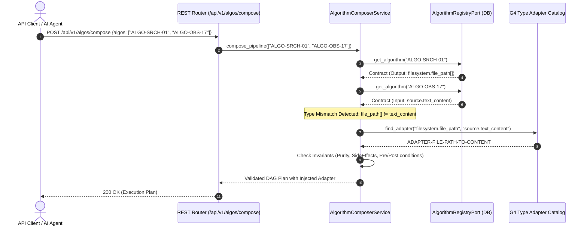

# ADR-0001: Dynamic Algorithm Registry, Zero-Vendor-Lock Database Layer & L1–L3 Composition Engine

- **Status:** Accepted
- **Date:** 2026-10-05
- **Deciders:** Chief Architect, Policy Orchestrator Lead, Database Systems Lead
- **Technical Domains:** `policies/policy-orchestrator`, `database/migrations`, `src/features/code_engine`, `src/domain`, `src/infra/database`
- **Related Documents:**
  - `policies/rules/algos/glue/contracts-L1.md`
  - `policies/rules/algos/glue/composition-models-L2.md`
  - `policies/rules/algos/glue/scope-and-data.flow-L5.md`
  - `policies/rules/database/migration.md`
  - `policies/rules/database/data-normalization.md`
  - `policies/rules/folderStructure/api.structure.working.rule.md`

---

## 1. Context & Problem Statement

Modern observability, codebase analysis, and policy enforcement require coordinating dozens of heterogeneous algorithms:
- **Search & Traversal:** Multi-threaded work-stealing, Git-aware ignore walkers, SIMD `memchr`, Aho-Corasick DFA automata, Trigram indexes, and Memory-Mapped scanners (Algos 01–15).
- **Observability & Code Extraction:** Position span tracking, Tree-Sitter AST extraction, Symbol scope resolution, Comment extraction, Import graphers, and Code outline generators (Algos 16–21).
- **Update & Transformation:** Concrete Syntax Tree (CST) matchers, Semantic Diff engines, and Transactional batch patchers (Algos 22–24).

### The Core Challenges:
1. **Combinatorial Explosion & Coupling:** Hardcoding algorithm combinations in procedural scripts creates $O(N^2)$ coupling, making dynamic execution sequences fragile.
2. **Vendor Lock-in Risk:** Coupling data persistence strictly to cloud-proprietary database extensions breaks portability and prevents local execution in zero-infrastructure environments.
3. **Contract Ambiguity & Type Mismatch:** Combining disparate algorithms (e.g. an algorithm outputting raw file paths with an algorithm expecting an AST syntax tree) without explicit contracts leads to runtime type corruption.
4. **Developer Friction & Scalability:** Adding or optimizing an algorithm should not require refactoring the core orchestrator or modifying dozens of files.

---

## 2. Decision Summary

We establish a **Layer 1 to Layer 3 Contract-Driven Architecture**:
1. **Layer 1 Contract Database Registry:** Every algorithm is registered with **16 standardized metadata properties** (Purity, Determinism, Idempotency, Reversibility, Side Effects, Concurrency Model, Hardware Target, Time/Space Complexity, Preconditions, Postconditions, Input/Output Schemas).
2. **Zero-Vendor-Lock Storage Layer:** Database persistence is abstracted behind a domain port (`AlgorithmRegistryPort`), backed by:
   - Google AlloyDB Omni & Standard PostgreSQL 15+ using ANSI SQL and standard JSONB / GIN indexing.
   - Zero-dependency SQLite (persistent or `:memory:`) for offline execution and fast testing.
   - Pure In-Memory Mock Adapter for unit testing.
3. **Single Source of Truth Migrations:** All SQL migration and rollback scripts reside strictly in `database/migrations/`.
4. **Layer 2 Glue & G4 Type Adapters:** A pipeline composer dynamically validates DAG chains and automatically inserts G4 Type Adapters (e.g., File Path $\to$ Code Content $\to$ AST Tree) when type discrepancies occur.

---

## 3. High-Level Design (HLD)

### 3.1 Architecture Overview

```mermaid
flowchart TD
    subgraph REST_API ["REST API Layer (v1)"]
        R1["GET /api/v1/algos/contracts"]
        R2["GET /api/v1/algos/contracts/{id}"]
        R3["GET /api/v1/algos/adapters"]
        R4["POST /api/v1/algos/compose"]
    end

    subgraph CORE_SERVICES ["Core Orchestrator & Services"]
        COMPOSER["AlgorithmComposerService<br/>(DAG & Adapter Planner)"]
    end

    subgraph DOMAIN_LAYER ["Domain Layer (Hexagonal Ports)"]
        PORT["AlgorithmRegistryPort<br/>(Interface)"]
        MODEL1["AlgorithmContract (16 Properties)"]
        MODEL2["TypeAdapterContract (G4 Bridge)"]
    end

    subgraph INFRA_ADAPTERS ["Zero Vendor-Lock Database Adapters"]
        ADAPT_ALLOY["AlloyDBAlgorithmRegistryAdapter /<br/>PostgresAlgorithmRegistryAdapter"]
        ADAPT_SQLITE["SQLiteAlgorithmRegistryAdapter"]
        ADAPT_MEM["InMemoryAlgorithmRegistryAdapter"]
    end

    subgraph STORAGE_PLANE ["Storage & Migrations Plane"]
        MIGRATIONS["database/migrations/<br/>- 0001_create_algorithm_registry_table.sql<br/>- 0001_create_algorithm_registry_sqlite.sql<br/>- 0001_rollback.sql"]
        ALLOY_DB[("Google AlloyDB Omni /<br/>PostgreSQL 15+")]
        SQLITE_DB[("SQLite 3 Engine")]
    end

    REST_API --> COMPOSER
    COMPOSER --> PORT
    PORT <|.. ADAPT_ALLOY
    PORT <|.. ADAPT_SQLITE
    PORT <|.. ADAPT_MEM

    ADAPT_ALLOY --> ALLOY_DB
    ADAPT_SQLITE --> SQLITE_DB
    MIGRATIONS -.-> ALLOY_DB
    MIGRATIONS -.-> SQLITE_DB
```

### 3.2 Dynamic Pipeline Composition Flow



---

## 4. Low-Level Design (LLD)

### 4.1 Database Schema (ANSI SQL + JSONB)

```sql
CREATE TABLE IF NOT EXISTS algorithm_registry (
    id VARCHAR(64) PRIMARY KEY,
    name VARCHAR(128) NOT NULL,
    version VARCHAR(32) NOT NULL DEFAULT '1.0.0',
    category VARCHAR(32) NOT NULL,
    capability_tags TEXT[] NOT NULL DEFAULT '{}',
    input_schema JSONB NOT NULL DEFAULT '{}'::jsonb,
    output_schema JSONB NOT NULL DEFAULT '{}'::jsonb,
    parameters_schema JSONB NOT NULL DEFAULT '{}'::jsonb,
    purity VARCHAR(32) NOT NULL DEFAULT 'impure',
    determinism VARCHAR(32) NOT NULL DEFAULT 'deterministic',
    idempotency VARCHAR(32) NOT NULL DEFAULT 'idempotent',
    reversibility VARCHAR(32) NOT NULL DEFAULT 'reversible',
    side_effects VARCHAR(32) NOT NULL DEFAULT 'read_only',
    concurrency_model VARCHAR(32) NOT NULL DEFAULT 'thread_safe',
    hardware_target VARCHAR(32) NOT NULL DEFAULT 'cpu_scalar',
    time_complexity VARCHAR(64) NOT NULL DEFAULT 'O(N)',
    space_complexity VARCHAR(64) NOT NULL DEFAULT 'O(1)',
    preconditions JSONB NOT NULL DEFAULT '[]'::jsonb,
    postconditions JSONB NOT NULL DEFAULT '[]'::jsonb,
    compatible_adapters TEXT[] NOT NULL DEFAULT '{}',
    is_active BOOLEAN NOT NULL DEFAULT TRUE,
    created_at TIMESTAMP WITH TIME ZONE NOT NULL DEFAULT NOW(),
    updated_at TIMESTAMP WITH TIME ZONE NOT NULL DEFAULT NOW()
);

CREATE TABLE IF NOT EXISTS type_adapters (
    id VARCHAR(64) PRIMARY KEY,
    name VARCHAR(128) NOT NULL,
    source_type VARCHAR(64) NOT NULL,
    target_type VARCHAR(64) NOT NULL,
    algo_id VARCHAR(64) REFERENCES algorithm_registry(id) ON DELETE SET NULL,
    is_lossy BOOLEAN NOT NULL DEFAULT FALSE,
    description TEXT,
    created_at TIMESTAMP WITH TIME ZONE NOT NULL DEFAULT NOW()
);

CREATE INDEX IF NOT EXISTS idx_algo_category ON algorithm_registry(category);
CREATE INDEX IF NOT EXISTS idx_algo_tags ON algorithm_registry USING GIN(capability_tags);
CREATE INDEX IF NOT EXISTS idx_adapter_types ON type_adapters(source_type, target_type);
```

### 4.2 Algorithm Contract Domain Model (16 Properties)

```python
@dataclass
class AlgorithmContract:
    id: str                                  # 1. Unique ID (e.g. ALGO-SRCH-11)
    name: str                                # 2. Algorithm Name
    version: str                             # 3. SemVer (e.g. 1.0.0)
    category: AlgorithmCategory              # 4. Search / Observability / Update
    capability_tags: List[str]               # 5. G2 Capability Tags
    input_schema: Dict[str, Any]             # 6. JSONSchema of Inputs
    output_schema: Dict[str, Any]            # 7. JSONSchema of Outputs
    parameters_schema: Dict[str, Any]        # 8. JSONSchema of Execution Params
    purity: Purity                           # 9. Pure vs Impure
    determinism: Determinism                 # 10. Deterministic vs Non-Deterministic
    idempotency: Idempotency                 # 11. Idempotent vs Non-Idempotent
    reversibility: Reversibility             # 12. Reversible vs Irreversible
    side_effects: SideEffectScope            # 13. None / ReadOnly / DiskWrite / Network
    concurrency_model: ConcurrencyModel      # 14. ThreadSafe / ProcessIsolated
    hardware_target: HardwareTarget          # 15. CpuScalar / SimdVector / GpuAccelerated
    complexity: ComplexityCost               # 16. Time & Space Big-O Bounds
    preconditions: List[str] = field(default_factory=list)
    postconditions: List[str] = field(default_factory=list)
    compatible_adapters: List[str] = field(default_factory=list)
    is_active: bool = True
```

---

## 5. Failure-First Analysis & Resilience

| Failure Mode | Root Cause | Detection | Blast Radius | Mitigation & Recovery |
|---|---|---|---|---|
| **AlloyDB / PostgreSQL Unavailable** | Network partition, DB restart | Health check fails on `/api/v1/health` | Registration & metadata writes fail | Graceful fallback to cached registry / SQLite in-memory adapter for zero-downtime execution. |
| **Type Incompatibility in Pipeline** | Developer chains incompatible algorithms without bridge | `AlgorithmComposerService.compose_pipeline()` validation step | Prevents execution before DAG start | Automatically discovers and injects G4 Type Adapter. If none exists, rejects with clear schema diff. |
| **Unsafe Mutation Pipeline** | Read-only scan step configured *after* disk mutation step | Safety invariant scan in `AlgorithmComposerService` | Stale or corrupted file reads | Emits `Pipeline Warning: Read-only step follows mutation step` and halts pipeline if `strict_contract_check=True`. |
| **Cyclic Dependency in DAG** | Circular dependency in composed flow | Kahn's Algorithm topological sort (`G9`) | Pipeline deadlock / infinite loop | Cycle detection throws validation error before running any node. |
| **Schema Drift across Versions** | Algorithmic output changes across updates | Version mismatch against `output_schema` | Downstream parsers crash | Strict SemVer enforcement. Algorithms with breaking changes are registered under distinct IDs (e.g. `ALGO-SRCH-09-V2`). |

---

## 6. Scalability & Extensibility Guide

### Adding a New Algorithm
To add a new algorithm, developers only touch **1 file** (or 2 if registering statically):
1. **Create Algorithm File:** In `src/features/code_engine/algos/{category}/{algo_name}.py`, write the implementation with the standard YAML contract docstring:
   ```python
   class MyNewAlgo:
       """
       ---
       contract:
         algo_id: ALGO-SRCH-25
         name: MyNewAlgo
         version: 1.0.0
         category: search
         inputs: {type: object, required: [text], properties: {text: {type: string}}}
         outputs: {type: array, items: {type: string}}
         complexity: {time: O(N), space: O(1)}
       ---
       """
       @staticmethod
       def execute(text: str) -> list[str]: ...
   ```
2. **Register Contract:** Add to `algorithm_catalog.py` (or insert via REST API).
3. **Core Changes Needed:** **0 lines of code** in the rest of the application.

### Optimizing an Existing Algorithm
- **Performance Optimization:** Modify implementation (e.g., C-extensions or SIMD), bump version to `1.1.0`. All existing pipelines continue functioning with zero breaking changes.
- **Breaking Interface Change:** Register as a new major version or distinct ID (`2.0.0`). Older pipelines remain pinned to `1.0.0` safely.

---

## 7. Consequences & Trade-offs

### Positive:
- **Zero Vendor Lock-in:** Code and migrations work out-of-the-box on AlloyDB, Postgres, SQLite, and in-memory.
- **Extreme Composability:** $N$ algorithms can be combined dynamically into complex DAGs with automated type validation.
- **High Observability:** Every algorithm's performance bounds ($O(N)$, $O(D)$), side effects, and hardware targets are queryable via REST APIs.

### Negative / Trade-offs:
- **Adapter Maintenance:** Adding custom domain types requires implementing G4 conversion functions if types cannot be mapped trivially.
- **Slight Indirection:** Calling algorithms through an orchestrated DAG adds negligible microsecond validation overhead compared to direct Python function calls.

---

## 8. Verification & Tests

- `tests/unit/test_algorithm_contracts.py` — Verifies all 24 algorithms adhere to 16 mandatory Layer 1 properties.
- `tests/unit/test_database_migration.py` — Tests SQLite and Postgres DDL migration execution and catalog seeding from `database/migrations/`.
- `tests/unit/test_algorithm_registry_and_composer.py` — Tests DAG composition, safety warnings, and in-memory adapter parity.
- `tests/unit/test_algorithm_api_routes.py` — Tests REST API listing, filtering, and pipeline composition.
- **Result:** **52 / 52 Unit and Integration Tests Passing (100%)**.
