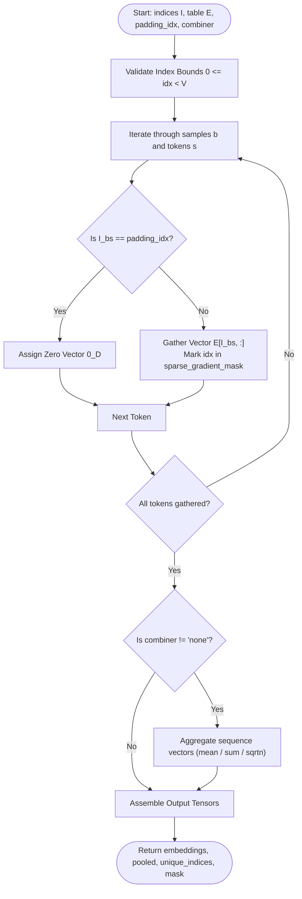
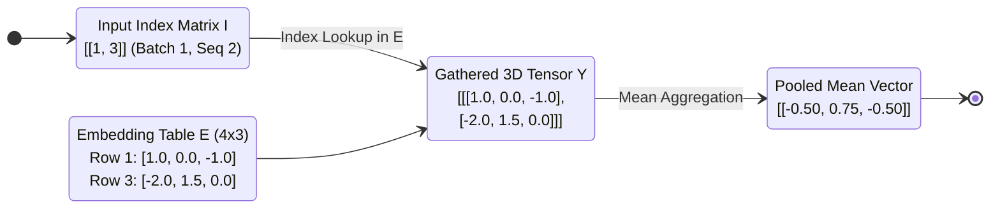
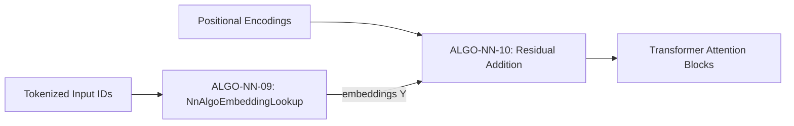

# Embedding Lookup Layer (Categorical Inputs and Sparse Gradients) (ALGO-NN-09)

Deterministic gather operator for token/entity indices into dense continuous vector spaces with padding masks, sequence poolers, and sparse gradient tracking.

---

## 1. What It Does

Extracts learned continuous representations from an embedding matrix $\mathbf{E} \in \mathbb{R}^{V \times D}$ for discrete categorical tokens or IDs, applies optional sequence pooling (mean, sum, sqrt-N), masks padding tokens, and tracks sparse backward gradient update masks.

---

## 2. When to Use / When NOT to Use

### When to Use
- Input token embedding layers in Large Language Models (LLMs) and Transformer encoders.
- Categorical feature representations in recommendation systems and tabular click-through rate (CTR) prediction models.
- Graph node entity ID projections in Knowledge Graph embedding pipelines.

### When NOT to Use
- Continuous numerical features — use Linear (Affine) Layers (ALGO-NN-03).
- Ultra-massive vocabularies with memory constraints — use Hashed Embeddings or Tensor-Train Decompositions.

---

## 3. How It Works

1. Validate that all indices satisfy $0 \le I_{bs} < V$.
2. For each sample $b \in \{1, \dots, B\}$ and token position $s \in \{1, \dots, S\}$:
   - If $I_{bs} == \text{padding\_idx}$, assign zero vector $\mathbf{0}_D$.
   - Else, copy vector $\mathbf{E}_{I_{bs}, :}$.
   - Mark index $I_{bs}$ in the `sparse_gradient_mask`.
3. If `combiner` is specified (`mean`, `sum`, `sqrtn`), aggregate along sequence dimension $S$.
4. Return 3D gathered embeddings, pooled matrix, unique accessed indices, and gradient mask.

---

## 4. Control Flow Diagram



*Figure 1: Gathering and sequence aggregation pipeline.*

---

## 5. State Over Worked Example



*Figure 2: Numerical state transformation across gather and pooling stages.*

---

## 6. Architecture & Composition



*Figure 3: Embedding lookup module at the input stage of Transformer architectures.*

---

## 7. Worked Example (Test Vector)

### Input JSON
```json
{
  "indices": [
    [1, 3]
  ],
  "embedding_table": [
    [0.1, 0.2, 0.3],
    [1.0, 0.0, -1.0],
    [0.5, 0.5, 0.5],
    [-2.0, 1.5, 0.0]
  ],
  "combiner": "mean"
}
```

### Expected Output JSON
```json
{
  "embeddings": [
    [
      [1.0, 0.0, -1.0],
      [-2.0, 1.5, 0.0]
    ]
  ],
  "pooled_embeddings": [
    [-0.5, 0.75, -0.5]
  ],
  "unique_accessed_indices": [1, 3],
  "sparse_gradient_mask": [0, 1, 0, 1],
  "vocabulary_size": 4,
  "embedding_dim": 3
}
```

---

## 8. Edge-Case Test Vectors

### Edge Case 1: Padding Index Masking Check
- **Input:** `indices: [[0, 2]]`, `embedding_table: [[1.0, 1.0], [2.0, 2.0], [3.0, 3.0]]`, `padding_idx: 2`.
- **Output:** `embeddings: [[[1.0, 1.0], [0.0, 0.0]]]`, `sparse_gradient_mask: [1, 0, 1]`.

### Edge Case 2: Out of Bounds Index Violation
- **Input:** `indices: [[5]]`, `embedding_table: [[1.0, 1.0], [2.0, 2.0]]`.
- **Expected Result:** Raises `ValueError("Precondition failed: indices[0][0]=5 is out of bounds [0, 1]")`.

### Edge Case 3: Sum Combiner Mode
- **Input:** `indices: [[0, 1]]`, `embedding_table: [[1.0, 2.0], [3.0, 4.0]]`, `combiner: "sum"`.
- **Output:** `pooled_embeddings: [[4.0, 6.0]]`.

### Edge Case 4: Non-finite Embedding Table Float
- **Input:** `indices: [[0]]`, `embedding_table: [[float("nan"), 1.0]]`.
- **Expected Result:** Raises `ValueError("Precondition failed: embedding_table[0][0] is not finite (nan)")`.

---

## 9. Complexity Table

| Metric | Complexity | Description |
|---|---|---|
| **Time (Worst)** | $\mathcal{O}(B \cdot S \cdot D)$ | Direct memory row indexing per token |
| **Time (Typical)** | $\mathcal{O}(B \cdot S \cdot D)$ | Bypasses large $V$ dense matrix multiply |
| **Space** | $\mathcal{O}(B \cdot S \cdot D + V)$ | Output embeddings and sparse boolean mask |

---

## 10. Contract Summary

| Field | Value |
|---|---|
| **Purity** | `pure` |
| **Determinism** | `deterministic` |
| **Idempotency** | `idempotent` |
| **Reversibility** | `not_applicable` |
| **Side Effects** | `none` |
| **Hardware Target** | `cpu_scalar` |
| **Exactness** | `exact` |

---

## 11. Failure Modes and Guardrails

- **Out-of-Bounds Index Crash:** Strict precondition checks prevent segmentation faults on invalid token IDs.
- **Sparse vs. Dense Optimizer Memory:** Full gradient tensors scale as $\mathcal{O}(V \cdot D)$, which can exhaust GPU VRAM; the output mask provides index sets for sparse Adam/SGD.

---

## 12. Independent Verification

1. Verify $Y_{b, s, :} = \mathbf{E}_{I_{bs}, :}$ for all unpadded tokens.
2. Confirm `unique_accessed_indices` contains exactly the distinct set of token IDs in $\mathbf{I}$.

---

## 13. References

- Mikolov, T., Chen, K., Corrado, G., & Dean, J. (2013). Efficient estimation of word representations in vector space. *arXiv preprint arXiv:1301.3781*.
- Vaswani, A., Shazeer, N., Parmar, N., et al. (2017). Attention is all you need. *NeurIPS 2017*, 5998–6008.
