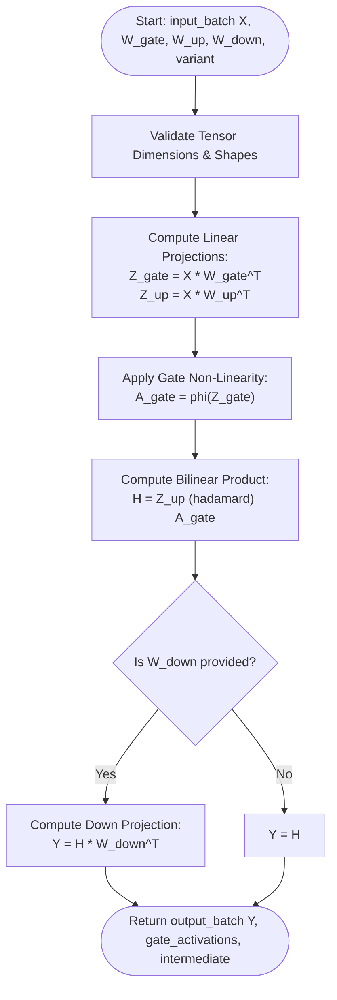
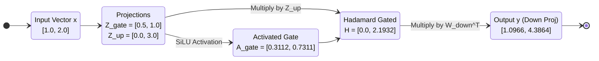

# Gated Linear Units (GLU, SwiGLU, GeGLU, ReGLU) (ALGO-NN-08)

Deterministic execution of bilinear gated feed-forward layers with activation gating ($\mathbf{h} = (\mathbf{X} \mathbf{W}_{\text{up}}^\top) \odot \phi(\mathbf{X} \mathbf{W}_{\text{gate}}^\top)$), down-projection, and parameter budget scaling.

---

## 1. What It Does

Computes bilinear gated representations where an up-projected feature vector is modulated element-wise by an activated gate vector. Supports SwiGLU, GeGLU, ReGLU, and standard GLU, and derives the $\frac{2}{3}$ width scaling rule for parameter parity in Large Language Models (LLMs).

---

## 2. When to Use / When NOT to Use

### When to Use
- Feedforward sublayers in modern Large Language Models (e.g., LLaMA, Mistral, Gemma, PaLM).
- Gated convolutional networks and speech synthesis backbones.
- Deep representation learning where multiplicative gating improves gradient propagation.

### When NOT to Use
- Memory-constrained edge microcontrollers where maintaining three projection matrices exceeds SRAM buffers — use standard 2-matrix ReLU/GELU MLP (ALGO-NN-02).

---

## 3. How It Works

1. Project input $\mathbf{X}$ onto gate space: $\mathbf{Z}_{\text{gate}} = \mathbf{X} \mathbf{W}_{\text{gate}}^\top$.
2. Project input $\mathbf{X}$ onto up space: $\mathbf{Z}_{\text{up}} = \mathbf{X} \mathbf{W}_{\text{up}}^\top$.
3. Compute gate activation: $\mathbf{A}_{\text{gate}} = \phi(\mathbf{Z}_{\text{gate}})$ (e.g., $\text{SiLU}$, $\text{GELU}$, $\text{ReLU}$, $\text{Sigmoid}$).
4. Compute intermediate Hadamard product: $\mathbf{H} = \mathbf{Z}_{\text{up}} \odot \mathbf{A}_{\text{gate}}$.
5. Project down to output space if $\mathbf{W}_{\text{down}}$ is provided: $\mathbf{Y} = \mathbf{H} \mathbf{W}_{\text{down}}^\top$.
6. Return output batch $\mathbf{Y}$, intermediate matrices, and parameter budget metrics.

---

## 4. Control Flow Diagram



*Figure 1: Bilinear gating feedforward execution pipeline.*

---

## 5. State Over Worked Example



*Figure 2: Numeric state transformation through the SwiGLU worked example.*

---

## 6. Architecture & Composition

```mermaid
flowchart LR
    Norm[Pre-Layer Normalization / RMSNorm] --> GLU[ALGO-NN-08: NnAlgoGatedLinearUnits]
    GLU --> ResAdd[ALGO-NN-10: Residual Addition x + F(x)]
```

*Figure 3: SwiGLU feedforward block in modern Transformer architectures (LLaMA/Mistral).*

---

## 7. Worked Example (Test Vector)

### Input JSON
```json
{
  "input_batch": [
    [1.0, 2.0]
  ],
  "weights_gate": [
    [0.5, 0.0],
    [-1.0, 1.0]
  ],
  "weights_up": [
    [1.0, -0.5],
    [2.0, 0.5]
  ],
  "weights_down": [
    [1.0, 0.5],
    [0.0, 2.0]
  ],
  "variant": "swiglu"
}
```

### Expected Output JSON
```json
{
  "output_batch": [
    [1.0965878705001716, 4.386351482000686]
  ],
  "gate_activations": [
    [0.3112296657989808, 0.7310585786300049]
  ],
  "gated_intermediate": [
    [0.0, 2.1931757358900147]
  ],
  "parameter_budget_ratio": 0.6666666666666666,
  "dimensions": [1, 2, 2, 2]
}
```

---

## 8. Edge-Case Test Vectors

### Edge Case 1: Without Down-Projection Matrix (Null $W_{\text{down}}$)
- **Input:** `input_batch: [[1.0, 1.0]]`, `weights_gate: [[1.0, 0.0]]`, `weights_up: [[2.0, 2.0]]`, `weights_down: null`, `variant: "reglu"`.
- **Output:** `output_batch: [[4.0]]`, `gate_activations: [[1.0]]`, `dimensions: [1, 2, 1, 1]`.

### Edge Case 2: GeGLU Variant Execution
- **Input:** `input_batch: [[0.0, 0.0]]`, `weights_gate: [[1.0, 1.0]]`, `weights_up: [[1.0, 1.0]]`, `variant: "geglu"`.
- **Output:** `output_batch: [[0.0]]`, `gate_activations: [[0.0]]`.

### Edge Case 3: Shape Mismatch Between Gate and Up Weights
- **Input:** `weights_gate: [[1.0, 0.0]]`, `weights_up: [[1.0, 0.0], [0.0, 1.0]]`.
- **Expected Result:** Raises `ValueError("Precondition failed: len(input.weights_up) 2 != d_h 1")`.

### Edge Case 4: Non-finite Weight Matrix Element
- **Input:** `weights_gate: [[float("inf"), 1.0]]`.
- **Expected Result:** Raises `ValueError("Precondition failed: weights_gate[0][0] is not finite (inf)")`.

---

## 9. Complexity Table

| Metric | Complexity | Description |
|---|---|---|
| **Time (Worst)** | $\mathcal{O}(B \cdot d_h (2 d_{\text{in}} + d_{\text{out}}))$ | 3 matrix multiplications + element-wise gating |
| **Time (Typical)** | $\mathcal{O}(B \cdot d_h (2 d_{\text{in}} + d_{\text{out}}))$ | Deterministic tensor GEMM |
| **Space** | $\mathcal{O}(B \cdot (d_h + d_{\text{out}}))$ | Intermediate gate and output buffers |

---

## 10. Contract Summary

| Field | Value |
|---|---|
| **Purity** | `pure` |
| **Determinism** | `deterministic` |
| **Idempotency** | `idempotent` |
| **Reversibility** | `not_applicable` |
| **Side Effects** | `none` |
| **Hardware Target** | `cpu_scalar` |
| **Exactness** | `exact` |

---

## 11. Failure Modes and Guardrails

- **Quadratic Magnitude Explosion:** Because $h = (x W_{\text{up}}) \odot \phi(x W_{\text{gate}})$, scaling $x \to c x$ scales intermediate activations by $c^2$. Guardrail: normalize inputs with RMSNorm or LayerNorm prior to projection.
- **Memory Overhead of 3 Projections:** In inference, fuse $\mathbf{W}_{\text{gate}}$ and $\mathbf{W}_{\text{up}}$ into a single concatenated GEMM.

---

## 12. Independent Verification

1. Calculate $z_{\text{gate}} = x W_{\text{gate}}^\top$ and $z_{\text{up}} = x W_{\text{up}}^\top$.
2. Compute $h = z_{\text{up}} \odot \text{SiLU}(z_{\text{gate}})$.
3. Verify $y = h W_{\text{down}}^\top$ matches the output vector.

---

## 13. References

- Dauphin, Y. N., Fan, A., Auli, M., & Grangier, D. (2017). Language modeling with gated convolutional networks. *ICML 2017*, 933–941.
- Shazeer, N. (2020). GLU variants improve transformer. *arXiv preprint arXiv:2002.05202*.
- Touvron, H., Lavril, T., Izacard, G., et al. (2023). LLaMA: Open and efficient foundation language models. *arXiv preprint arXiv:2302.13971*.
