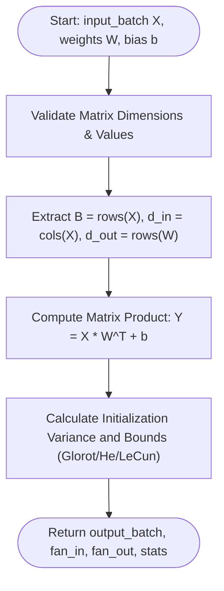
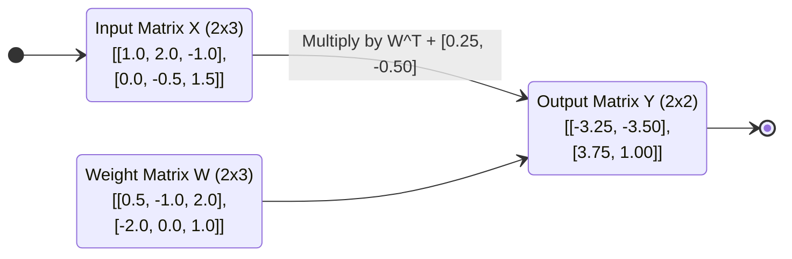
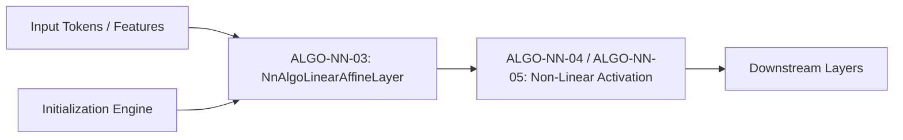

# Linear (Affine) Layer and Fan-In / Fan-Out Initialization (ALGO-NN-03)

Deterministic batched affine transformation $\mathbf{Y} = \mathbf{X} \mathbf{W}^\top + \mathbf{b}$ with fan-in/fan-out variance scaling initializers.

---

## 1. What It Does

Computes matrix multiplication of an input batch by a transposed weight matrix with additive bias, and calculates theoretical variance and uniform sampling bounds under Glorot (Xavier), He (Kaiming), and LeCun initialization rules.

---

## 2. When to Use / When NOT to Use

### When to Use
- Standard fully-connected layers, projection heads, and linear classification heads.
- Transformer query, key, value, and output projections ($W_Q, W_K, W_V, W_O$).
- Dimension up/down projections in bottleneck blocks.

### When NOT to Use
- When sparse embedding indexing is required — use Embedding Lookup Layers (ALGO-NN-09).
- When parameter count must be reduced via weight factorization without full rank — use Low-Rank Adaptations (LoRA).

---

## 3. How It Works

1. Validate input shapes: verify that $\mathbf{X}$ is $(B \times d_{\text{in}})$, $\mathbf{W}$ is $(d_{\text{out}} \times d_{\text{in}})$, and $\mathbf{b}$ is $(d_{\text{out}})$.
2. For each sample $i \in \{1, \dots, B\}$ and output neuron $j \in \{1, \dots, d_{\text{out}}\}$:
   - Compute inner product $Y_{ij} = \sum_{k=1}^{d_{\text{in}}} X_{ik} W_{jk} + b_j$.
3. Compute theoretical variance $\sigma^2$ and uniform bound $r = \sqrt{3\sigma^2}$ based on the selected initialization mode:
   - **Glorot:** $\sigma^2 = \frac{2}{d_{\text{in}} + d_{\text{out}}}$
   - **Kaiming:** $\sigma^2 = \frac{2}{d_{\text{in}}}$
   - **LeCun:** $\sigma^2 = \frac{1}{d_{\text{in}}}$
4. Return output matrix $\mathbf{Y}$, dimensional metrics, and initialization boundaries.

---

## 4. Control Flow Diagram



*Figure 1: Control flow for affine matrix transformation and variance computation.*

---

## 5. State Over Worked Example



*Figure 2: Numerical state transformation across the 2x3 to 2x2 linear projection.*

---

## 6. Architecture & Composition



*Figure 3: Linear layer positioning in standard deep learning pipelines.*

---

## 7. Worked Example (Test Vector)

### Input JSON
```json
{
  "input_batch": [
    [1.0, 2.0, -1.0],
    [0.0, -0.5, 1.5]
  ],
  "weights": [
    [0.5, -1.0, 2.0],
    [-2.0, 0.0, 1.0]
  ],
  "bias": [0.25, -0.50],
  "init_mode": "glorot_uniform"
}
```

### Expected Output JSON
```json
{
  "output_batch": [
    [-3.25, -3.5],
    [3.75, 1.0]
  ],
  "fan_in": 3,
  "fan_out": 2,
  "batch_size": 2,
  "theoretical_variance": 0.4,
  "theoretical_bound": 1.0954451150103321
}
```

---

## 8. Edge-Case Test Vectors

### Edge Case 1: Null Bias Vector (Zero-bias linear operator)
- **Input:** `input_batch: [[2.0, -1.0]]`, `weights: [[3.0, 4.0]]`, `bias: null`.
- **Output:** `output_batch: [[2.0]]`, `fan_in: 2`, `fan_out: 1`, `batch_size: 1`.

### Edge Case 2: Kaiming Normal Initialization Mode
- **Input:** `input_batch: [[1.0, 2.0]]`, `weights: [[1.0, 1.0]]`, `init_mode: "kaiming_normal"`.
- **Output:** `theoretical_variance: 1.0`, `theoretical_bound: null`.

### Edge Case 3: Dimension Mismatch Error
- **Input:** `input_batch: [[1.0, 2.0]]`, `weights: [[1.0, 2.0, 3.0]]`.
- **Expected Result:** Raises `ValueError("Precondition failed: weights row 0 length 3 != expected d_in 2")`.

### Edge Case 4: Non-finite Value in Weight Matrix
- **Input:** `input_batch: [[1.0]]`, `weights: [[float("inf")]]`.
- **Expected Result:** Raises `ValueError("Precondition failed: weights[0][0] is not finite (inf)")`.

---

## 9. Complexity Table

| Metric | Complexity | Description |
|---|---|---|
| **Time (Worst)** | $\mathcal{O}(B \cdot d_{\text{in}} \cdot d_{\text{out}})$ | Standard dense matrix multiplication |
| **Time (Typical)** | $\mathcal{O}(B \cdot d_{\text{in}} \cdot d_{\text{out}})$ | Deterministic arithmetic across all batches |
| **Space** | $\mathcal{O}(B \cdot d_{\text{out}})$ | Output matrix storage |

---

## 10. Contract Summary

| Field | Value |
|---|---|
| **Purity** | `pure` |
| **Determinism** | `deterministic` |
| **Idempotency** | `idempotent` |
| **Reversibility** | `not_applicable` |
| **Side Effects** | `none` |
| **Hardware Target** | `cpu_scalar` |
| **Exactness** | `exact` |

---

## 11. Failure Modes and Guardrails

- **Mismatched Tensor Dimensions:** Enforced before matrix multiply to prevent shape corruption.
- **Unscaled Initialization in Deep Networks:** Selecting an incompatible initialization mode leads to vanishing gradients in initial epochs.

---

## 12. Independent Verification

1. Calculate $Y_{ij} = \sum_k X_{ik} W_{jk} + b_j$ by hand for each element.
2. Confirm $\sigma^2$ matches the exact variance formula $\frac{2}{d_{\text{in}} + d_{\text{out}}}$ for Glorot mode.

---

## 13. References

- Glorot, X., & Bengio, Y. (2010). Understanding the difficulty of training deep feedforward neural networks. *AISTATS 2010*, 249–256.
- He, K., Zhang, X., Ren, S., & Sun, J. (2015). Delving deep into rectifiers: Surpassing human-level performance on ImageNet classification. *ICCV 2015*, 1026–1034. DOI: [10.1109/ICCV.2015.123](https://doi.org/10.1109/ICCV.2015.123).
- LeCun, Y., Bottou, L., Orr, G. B., & Müller, K.-R. (1998). Efficient backprop. *Neural Networks: Tricks of the Trade*, 9–50. DOI: [10.1007/3-540-49430-8_2](https://doi.org/10.1007/3-540-49430-8_2).
