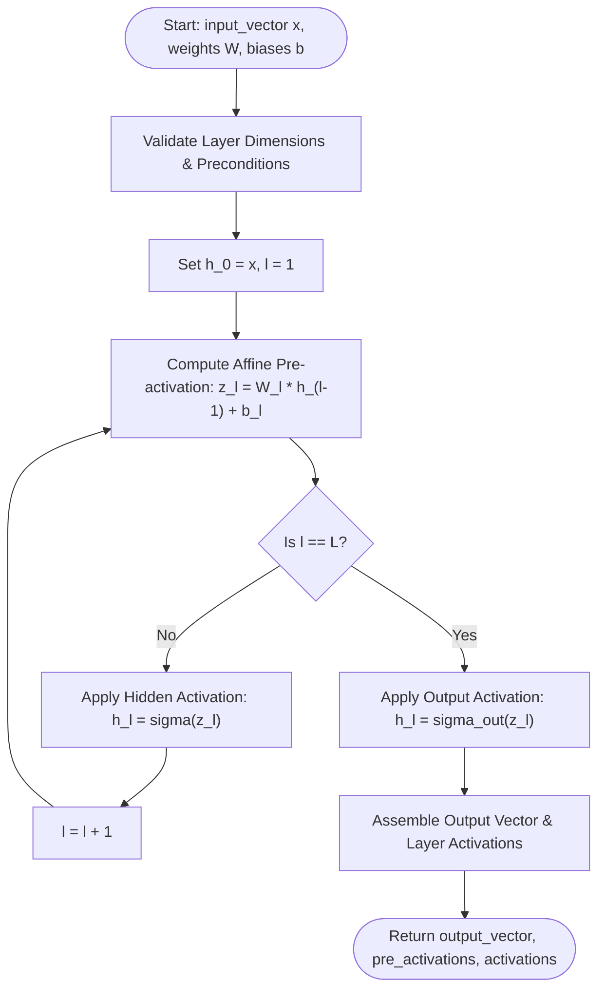
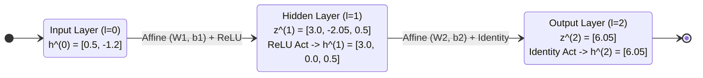
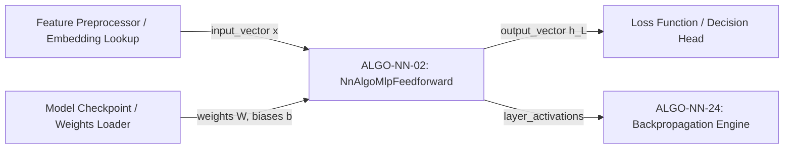

# Multilayer Perceptron (MLP) Feedforward Evaluation (ALGO-NN-02)

Deterministic forward propagation across an $L$-layer Multilayer Perceptron composed of affine transformations and non-linear component-wise activations.

---

## 1. What It Does

Evaluates an input feature vector through a sequence of parameterized linear transformations interleaved with non-linear activation functions. Computes intermediate pre-activations, hidden activations, and the final output vector according to the Universal Approximation Theorem.

---

## 2. When to Use / When NOT to Use

### When to Use
- Tabular feature classification and regression with continuous, categorical, or dense embeddings.
- Prediction heads placed on top of transformer backbones, CNN encoders, or GNN representations.
- Sub-layer feedforward blocks in deep neural architectures.

### When NOT to Use
- High-dimensional spatial signals (images, video) — use Convolutional Neural Networks (CNNs) instead.
- Variable-length sequential or autoregressive data — use Transformers or Recurrent Neural Networks (RNNs).
- Tabular tabular data where gradient-boosted decision trees (XGBoost, LightGBM, CatBoost) achieve superior sample efficiency.

---

## 3. How It Works

1. Initialize the activation state $\mathbf{h}^{(0)}$ with the input vector $\mathbf{x}$.
2. For each layer $l \in \{1, \dots, L\}$:
   - Compute the affine pre-activation: $\mathbf{z}^{(l)} = \mathbf{W}^{(l)} \mathbf{h}^{(l-1)} + \mathbf{b}^{(l)}$.
   - Apply the activation function: $\mathbf{h}^{(l)} = \sigma(\mathbf{z}^{(l)})$ for hidden layers, or $\sigma_{\text{out}}(\mathbf{z}^{(L)})$ for the output layer.
3. Record all layer pre-activations $\mathbf{z}^{(l)}$ and layer activations $\mathbf{h}^{(l)}$.
4. Return the final output vector $\mathbf{h}^{(L)}$ alongside the full execution trace.

---

## 4. Control Flow Diagram



*Figure 1: Deterministic layer-by-layer forward propagation loop.*

---

## 5. State Over Worked Example



*Figure 2: Numerical state transformation across the 2-layer worked example.*

---

## 6. Architecture & Composition



*Figure 3: System composition of the feedforward MLP module within an inference and training pipeline.*

---

## 7. Worked Example (Test Vector)

### Input JSON
```json
{
  "input_vector": [0.5, -1.2],
  "weights": [
    [
      [1.0, -2.0],
      [0.5, 1.5],
      [-1.0, 0.0]
    ],
    [
      [2.0, -1.0, 0.5]
    ]
  ],
  "biases": [
    [0.1, -0.5, 1.0],
    [-0.2]
  ],
  "hidden_activation": "relu",
  "output_activation": "identity"
}
```

### Expected Output JSON
```json
{
  "output_vector": [6.05],
  "layer_pre_activations": [
    [3.0, -2.05, 0.5],
    [6.05]
  ],
  "layer_activations": [
    [3.0, 0.0, 0.5],
    [6.05]
  ],
  "num_layers": 2,
  "layer_dimensions": [2, 3, 1]
}
```

---

## 8. Edge-Case Test Vectors

### Edge Case 1: Single Layer Network ($L=1$) with Sigmoid Output
- **Input:** `input_vector: [1.0, 2.0]`, `weights: [[[0.5, -0.5]]]`, `biases: [[0.0]]`, `output_activation: "sigmoid"`.
- **Pre-activation:** `z = (0.5)(1.0) + (-0.5)(2.0) = -0.5`.
- **Output:** `output_vector: [0.3775406687981454]`, `num_layers: 1`, `layer_dimensions: [2, 1]`.

### Edge Case 2: Extreme Activation Values Clamping Check
- **Input:** `input_vector: [100.0]`, `weights: [[[1.0]], [[-1.0]]]`, `biases: [[0.0], [0.0]]`, `hidden_activation: "sigmoid"`, `output_activation: "sigmoid"`.
- **Layer 1:** `z1 = 100.0` $\implies h_1 = 1.0$.
- **Layer 2:** `z2 = -1.0` $\implies h_2 = \sigma(-1.0) \approx 0.2689414213699951$.

### Edge Case 3: Dimension Mismatch Error
- **Input:** `input_vector: [1.0, 2.0]`, `weights: [[[1.0, 2.0, 3.0]]]`, `biases: [[0.0]]`.
- **Expected Result:** Raises `ValueError("Precondition failed: layer 0 weight row 0 length 3 != expected in_dim 2")`.

### Edge Case 4: Non-finite Numeric Input
- **Input:** `input_vector: [float("nan"), 1.0]`.
- **Expected Result:** Raises `ValueError("Precondition failed: input_vector[0] must be a finite number (got nan)")`.

---

## 9. Complexity Table

| Metric | Complexity | Description |
|---|---|---|
| **Time (Worst)** | $\mathcal{O}\left(\sum_{l=1}^L d_l d_{l-1}\right)$ | Bounded by sum of matrix-vector products across all $L$ layers |
| **Time (Typical)** | $\mathcal{O}\left(\sum_{l=1}^L d_l d_{l-1}\right)$ | Identical for all dense inputs |
| **Space** | $\mathcal{O}\left(\sum_{l=0}^L d_l\right)$ | Allocates intermediate pre-activation and activation vectors |

*Variables:* $L$: number of layers; $d_0$: input dimension; $d_l$: output width of layer $l$.

---

## 10. Contract Summary

| Field | Value |
|---|---|
| **Purity** | `pure` |
| **Determinism** | `deterministic` |
| **Idempotency** | `idempotent` |
| **Reversibility** | `not_applicable` |
| **Side Effects** | `none` |
| **Hardware Target** | `cpu_scalar` |
| **Exactness** | `exact` |

---

## 11. Failure Modes and Guardrails

- **Vanishing/Exploding Activations:** Saturating activations (Sigmoid, Tanh) in deep MLPs lead to gradient death. Use ReLU/GELU or Layer Normalization between deep stages.
- **Dead ReLU Units:** Persistent negative pre-activations cause zero gradients. Monitor active neuron fractions or initialize biases to small positive constants.
- **Dimension Inconsistencies:** Automatically verified by rigorous shape validation in `NnAlgoMlpFeedforward.forward`.

---

## 12. Independent Verification

1. Verify $d_0 = \text{len}(\mathbf{x})$.
2. For each layer $l \in \{1, \dots, L\}$, verify $\mathbf{z}^{(l)} = \mathbf{W}^{(l)} \mathbf{h}^{(l-1)} + \mathbf{b}^{(l)}$.
3. Verify $h_i^{(l)} = \sigma(z_i^{(l)})$ for $l < L$ and component-wise output activation on layer $L$.
4. Check that all numerical values match the forward contract output.

---

## 13. References

- Cybenko, G. (1989). Approximation by superpositions of a sigmoidal function. *Mathematics of Control, Signals, and Systems*, 2(4), 303–314. DOI: [10.1007/BF02551274](https://doi.org/10.1007/BF02551274).
- Hornik, K. (1991). Approximation capabilities of multilayer feedforward networks. *Neural Networks*, 4(2), 251–257. DOI: [10.1016/0893-6080(91)90009-T](https://doi.org/10.1016/0893-6080(91)90009-T).
- Rumelhart, D. E., Hinton, G. E., & Williams, R. J. (1986). Learning representations by back-propagating errors. *Nature*, 323(6088), 533–536. DOI: [10.1038/323533a0](https://doi.org/10.1038/323533a0).
