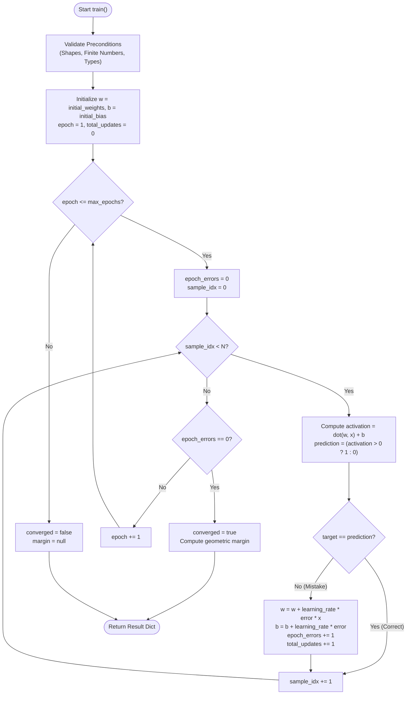
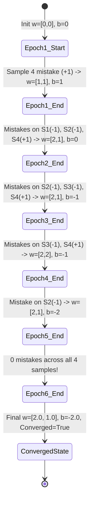
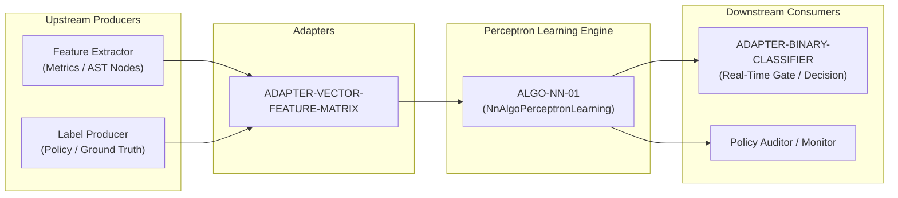

# Perceptron Mistake-Driven Learning Rule (ALGO-NN-01)

> **ID:** ALGO-NN-01  
> **Summary:** The fundamental single-neuron linear classifier that iteratively learns separating hyperplanes via mistake-driven parameter updates.

---

## 1. Intuitive Definition & Plain-English Glossary

If you don't come from a mathematics background, think of the **Perceptron** as a **smart decision-making scale with adjustable weight dials**.

Imagine you are a bank manager deciding whether to approve or reject a loan application based on two numbers: `Income` and `Credit Score`. 

```
               [ Income: $80k ] ---------> (Dial w1: 0.5) \
                                                            +---> [ Add together ] + (Base Bias b: -40) ---> [ Is total > 0 ? ] ---> YES (Approve)
               [ Credit: 720  ] ---------> (Dial w2: 0.1) /                                                                   ---> NO  (Reject)
```

### The Plain-English Glossary of Terms

| Term | Symbol | What it actually means in simple terms | Real-world Analogy |
|---|---|---|---|
| **Features / Inputs** | $\mathbf{x} = [x_1, x_2]$ | The raw facts or measurements about an item. | A person's `[Age, Income, Credit Score]`. |
| **Weights** | $\mathbf{w} = [w_1, w_2]$ | "Importance knobs". How strongly each feature influences the final decision. | If income is twice as important as age, its knob is set twice as high. |
| **Bias** | $b$ | A baseline threshold or natural inclination before looking at any evidence. | A strict bank has a negative bias (starts at "No" by default until proven worthy). |
| **Dot Product** | $\mathbf{w} \cdot \mathbf{x}$ | Simply: multiply each input by its importance and add them up: $(w_1 x_1 + w_2 x_2)$. | Calculating a weighted test score: $(0.4 \times \text{Exam}) + (0.6 \times \text{Project})$. |
| **Total Activation** | $z = \mathbf{w} \cdot \mathbf{x} + b$ | The overall score. | The final score on the scoreboard. |
| **Decision Rule** | $f(\mathbf{x})$ | If total score $z > 0$, output `1` (Yes); if $z \le 0$, output `0` (No). | Passing (score $\ge 50$) vs Failing (score $< 50$). |
| **Decision Line / Hyperplane** | $\mathbf{w} \cdot \mathbf{x} + b = 0$ | A straight line drawn on a graph that splits "Yes" points from "No" points. | A fence built across a field separating sheep from wolves. |
| **Learning Rate** | $\eta$ (eta) | How drastically the algorithm changes its mind after making a mistake. | Big leap (fast but reckless) vs small careful adjustments. |
| **Epoch** | $E$ | One full pass going through all your flashcards / training samples once. | Reviewing an entire study deck from card 1 to card $N$. |

---

## 2. How the Perceptron Replicates Human & Biological Learning

The Perceptron was directly designed in 1958 by Frank Rosenblatt to mimic a biological brain cell (**Neuron**).

```
  BIOLOGICAL BRAIN NEURON                        ARTIFICIAL PERCEPTRON
  =======================                        =====================
  
       Dendrites                                       Inputs (x1, x2)
    (Receive signals)                                (Incoming data facts)
           \                                                  \
            \  Synaptic Gaps                                   \  Weights (w1, w2)
             O (Chemical strengths)                             * (Multiplication dials)
              \                                                  \
               v                                                  v
         +------------+                                     +------------+
         | Cell Body  |                                     | Summation  |
         |   (Soma)   |                                     |    (Σ)     |
         | Accumulates|                                     | Total score|
         | electrical |                                     | w1*x1+w2*x2|
         |   charge   |                                     |    + b     |
         +------------+                                     +------------+
               |                                                  |
               v Axon Hillock                                     v Threshold Step
         +------------+                                     +------------+
         | Threshold: |                                     | Check:     |
         | Enough     |                                     | Is sum > 0?|
         | charge to  |                                     | Yes = 1    |
         | fire?      |                                     | No  = 0    |
         +------------+                                     +------------+
               |                                                  |
               v Axon Terminal                                    v Output
          [ FIRES SPIKE ]                                    [ PREDICTION ]
```

### How Humans Learn: The "Trial & Error" Mistake Rule
Think of how a child learns what is safe to touch:
1. **Initial state:** The child has no pre-formed opinion ($w = 0, b = 0$).
2. **Action (Prediction):** Child reaches toward a hot candle flame (predicts "Safe to touch").
3. **Feedback (Mistake):** Flame hurts (Label = "Danger! Mistake detected!").
4. **Correction:** The child immediately updates their internal weight dial with a massive negative penalty against touching flames.
5. **If no mistake:** If the child touches a harmless toy, nothing went wrong, so no internal beliefs need to be modified.

**The Perceptron does the exact same thing:**
- **If prediction is correct:** Do **NOTHING** ($\Delta w = 0$).
- **If it mistakenly said NO (0) to a YES (1):** Add the input vector to the weights: $w \leftarrow w + x$.
- **If it mistakenly said YES (1) to a NO (0):** Subtract the input vector from the weights: $w \leftarrow w - x$.

---

## 3. Visualizing How the Boundary Physically Shifts (Step-by-Step)

Here is what is physically happening on a 2D graph during training. We have two features ($x_1, x_2$) and we want to separate `[0]` (Red O) from `[1]` (Green X).

### Step 1: Initial State (Weights are 0, Line is Undefined)
The model knows nothing. It makes a mistake by predicting `0` for a Green X at coordinate `(1, 1)`.

```
     x2 ^
        |       (0,1) [O]          (1,1) [X]  <--- Model predicted 0 (MISTAKE!)
        |
        |
        |       (0,0) [O]          (1,0) [O]
        +-----------------------------------> x1
```
*Correction applied:* $w \leftarrow w + [1, 1] = [1, 1]$, $b \leftarrow b + 1 = 1$.

---

### Step 2: Line Shift After Mistake 1 (Line is in the wrong place)
The decision line is $1 \cdot x_1 + 1 \cdot x_2 + 1 = 0$. Now it predicts `1` for all samples, making mistakes on the Red O points!

```
     x2 ^                         \  Boundary Line: x1 + x2 + 1 = 0
        |       (0,1) [O]          \         (1,1) [X]
        |        (Mistake!)         \
        |                            \
        |       (0,0) [O]             \      (1,0) [O]
        +------------------------------\-----> x1
```
*Correction applied:* When it sees Red O at `(0, 1)`, it subtracts: $w \leftarrow w - [0, 1] = [1, 0]$, $b \leftarrow b - 1 = 0$.

---

### Step 3: Progressive Tilting and Shifting Across Epochs
Each mistake physically **tilts (rotates)** the slope of the line and **slides (translates)** its position across the grid:

```
     x2 ^
        |       (0,1) [O]                    (1,1) [X]
        |                         . '
        |                     . '       <--- Line rotates clockwise
        |                 . '
        |       (0,0) [O]                    (1,0) [O]
        +-----------------------------------> x1
```

---

### Step 4: Final Converged State (Perfect Separation)
The line settles at $2 x_1 + 1 x_2 - 2 = 0$. All `[O]` points are strictly below the line (Score $\le 0$) and the `[X]` point is strictly above the line (Score $> 0$). **Zero mistakes!**

```
     x2 ^                                   
        |       (0,1) [O]             /      (1,1) [X]  (Score = +1 > 0 -> PASS)
        |       (Score = -1 <= 0)    /
        |                           /  FINAL DECISION BOUNDARY
        |                          /   2*x1 + 1*x2 - 2 = 0
        |       (0,0) [O]         /          (1,0) [O]
        |       (Score = -2 <=0) /           (Score = 0 <= 0)
        +-----------------------/-----------> x1
```

---

## 4. Why This Algorithm Even Exists & Where It Is Used in Real Life

### Why It Exists in Computer Science History
1. **The First Learning Machine:** Before 1958, computers had to be manually programmed with hardcoded `if/else` conditions for every rule. The Perceptron proved a machine could discover its own rules from raw data.
2. **Building Block of Modern AI:** Every multi-billion-parameter LLM (like GPT-4, Claude, Gemini) and vision model is composed of millions of these artificial neurons stacked in layers with non-linear activation functions.

### Real-World Use Cases Today
* **Spam vs. Ham Email Filtering:** 
  - $x_1 =$ occurrences of word "FREE", $x_2 =$ occurrences of word "VIAGRA", $x_3 =$ count of all-caps words.
  - If $w_1 x_1 + w_2 x_2 + w_3 x_3 + b > 0$, send email to Spam folder.
* **Credit Card Fraud Detection:**
  - $x_1 =$ transaction amount, $x_2 =$ distance from cardholder's home address, $x_3 =$ transaction frequency in last 10 minutes.
  - Real-time instant decision to block or allow transaction in sub-millisecond time.
* **Network Firewall Packet Dropping:**
  - $x_1 =$ SYN packet rate, $x_2 =$ source port entropy.
  - Hardwired on edge routers in standard CPU/FPGA instructions for wire-speed threat blocking.
* **Policy Invariant Gates (This Repository):**
  - Instant classification of code telemetry metrics into `Compliant (1)` vs `Violation (0)`.

---

## 5. When to Use & When NOT to Use

### When to Use
- **Linearly Separable Binary Classification:** When data classes can be completely separated by a straight flat line or flat boundary.
- **Ultra-Low Memory Embedded & Edge Environments:** Runs in microscopic memory ($O(d)$ space) with basic scalar additions and multiplications.
- **Online Streaming Learning:** Learns sample-by-sample on live incoming streams without saving old data.
- **Fast Baseline:** Takes 1 millisecond to train; perfect as a sanity-check baseline.

### When NOT to Use
- **Non-Linearly Separable Data (The Famous XOR Problem):** If the data points form a criss-cross pattern (e.g. diagonal corners are class 1, opposite diagonal is class 0), no single straight line can separate them. The Perceptron will cycle forever. (Solution: Use Multilayer Perceptron MLP / ALGO-NN-02).
- **Probabilities Needed:** The Perceptron gives a hard binary `0` or `1` with no confidence percentage (e.g. "87% chance of rain"). (Solution: Use Logistic Regression / ALGO-CLASSICAL-ML-01).
- **Heavy Noise or Overlapping Data:** If positive and negative points overlap, mistake updates will oscillate endlessly. (Solution: Soft-Margin Support Vector Machine).

### When to Use
- **Linearly Separable Binary Classification:** When data classes can be completely separated by a flat linear boundary.
- **Ultra-Low Memory Embedded and Edge Environments:** When model parameters must fit in minimal memory footprints with O(d) compute per sample.
- **Online and Streaming Mistake-Driven Learning:** When sample-by-sample corrections are desired without storing historical batches or computing second-order matrices.
- **Fast Baseline Generation:** As a minimal-complexity baseline before evaluating deep neural architectures or kernel machines.

### When NOT to Use
- **Non-Linearly Separable Data (such as XOR):** The Perceptron will never converge and will cycle perpetually. Use a Multilayer Perceptron (MLP) (ALGO-NN-02) or Support Vector Machine with RBF Kernel (ALGO-CLASSICAL-ML-02).
- **Probabilistic Calibration Required:** The Perceptron outputs hard step decisions (0 or 1) without posterior class probabilities. Use Logistic Regression (ALGO-CLASSICAL-ML-01).
- **Noisy Labels / Overlapping Distributions:** Mistakes caused by noise cause persistent weight oscillation. Use Soft-Margin SVM or regularized gradient descent.

---

## 5. Step-by-Step Execution Procedure

1. **Initialize Parameters:** Set the initial weight vector to all zeros (length d) and bias to 0.0 (or use user-supplied initial parameters).
2. **Iterate Across Epochs:** For each epoch up to max_epochs, reset the epoch mistake counter to 0.
3. **Compute Linear Activation:** For each training sample, calculate the dot product of weights and input features, then add the bias term: $z = \sum_{j=1}^d w_j x_{ij} + b$.
4. **Evaluate Decision Threshold:** If the activation $z > 0$, predict 1; otherwise, predict 0.
5. **Calculate Mistake Error:** Compute the error as $(y_i - \hat{y}_i)$, yielding $-1$, $0$, or $+1$.
6. **Apply Mistake Update:** If the error is not zero:
   - Update each weight coordinate: $w_j \leftarrow w_j + \eta \cdot (y_i - \hat{y}_i) \cdot x_{ij}$.
   - Update bias: $b \leftarrow b + \eta \cdot (y_i - \hat{y}_i)$.
   - Increment total updates and the epoch error counter.
7. **Check Epoch Convergence:** If an epoch completes with 0 mistakes, mark converged as True and exit early.
8. **Compute Verification Margin:** If converged and the Euclidean norm of the weight vector is positive, calculate the minimum signed distance from the samples to the decision boundary.

---

## 6. Diagram 1 — Control Flow


*Figure 1: Control flow of the mistake-driven Perceptron training loop detailing epoch and sample iterations.*

---

## 7. Diagram 2 — State Over Worked Example


*Figure 2: Trajectory of weights and bias across training epochs on the Logical AND dataset.*

---

## 8. Diagram 3 — Composition in Pipeline


*Figure 3: System integration pipeline showing upstream feature producers, adapter contracts, and downstream decision gates.*

---

## 9. Worked Example (Test Vector)

Canonical 2D Logical AND dataset with 4 samples:
- Sample 1: features [0.0, 0.0] with label 0
- Sample 2: features [0.0, 1.0] with label 0
- Sample 3: features [1.0, 0.0] with label 0
- Sample 4: features [1.0, 1.0] with label 1

### Input JSON
```json
{
  "features": [
    [0.0, 0.0],
    [0.0, 1.0],
    [1.0, 0.0],
    [1.0, 1.0]
  ],
  "labels": [0, 0, 0, 1],
  "learning_rate": 1.0,
  "max_epochs": 10,
  "initial_weights": [0.0, 0.0],
  "initial_bias": 0.0
}
```

### Expected Output JSON
```json
{
  "weights": [2.0, 1.0],
  "bias": -2.0,
  "converged": true,
  "epochs_trained": 6,
  "total_updates": 10,
  "final_error_count": 0,
  "margin": 0.0
}
```

---

## 10. Edge-Case Test Vectors

### Vector 1: Empty Features (Precondition Violation)
- **Input:** `{"features": [], "labels": []}`
- **Result:** `ValueError("Precondition failed: len(input.features) > 0")`

### Vector 2: Non-Separable XOR Problem (Bounded Epoch Limit)
- **Input:**
  ```json
  {
    "features": [[0.0, 0.0], [0.0, 1.0], [1.0, 0.0], [1.0, 1.0]],
    "labels": [0, 1, 1, 0],
    "learning_rate": 1.0,
    "max_epochs": 10
  }
  ```
- **Output:**
  ```json
  {
    "weights": [-1.0, 0.0],
    "bias": 1.0,
    "converged": false,
    "epochs_trained": 10,
    "total_updates": 37,
    "final_error_count": 4,
    "margin": null
  }
  ```

### Vector 3: Single Positive Sample
- **Input:**
  ```json
  {
    "features": [[1.0, 2.0]],
    "labels": [1],
    "learning_rate": 1.0,
    "max_epochs": 5
  }
  ```
- **Output:**
  ```json
  {
    "weights": [1.0, 2.0],
    "bias": 1.0,
    "converged": true,
    "epochs_trained": 2,
    "total_updates": 1,
    "final_error_count": 0,
    "margin": 2.6832815729997477
  }
  ```

### Vector 4: Dimension Mismatch (Precondition Violation)
- **Input:** `{"features": [[1.0, 2.0], [1.0]], "labels": [1, 0]}`
- **Result:** `ValueError("Precondition failed: all(len(row) == len(input.features[0])) (row 1 length 1 != 2)")`

---

## 11. Complexity Table

| Metric | Complexity | Description / Variables |
|---|---|---|
| **Time (Worst Case)** | O(E * N * d) | N samples, d dimensions, E maximum epochs |
| **Time (Typical Case)**| O(E * N * d) | E epochs until convergence |
| **Space (Auxiliary)** | O(d) | Stores weight vector of size d and scalar bias |

---

## 12. Contract Summary

| Contract Field | Value | Rationale |
|---|---|---|
| `algo_id` | `ALGO-NN-01` | Unique registry taxonomy key |
| `purity` | `pure` | Function of inputs only; no external lookups |
| `determinism` | `deterministic` | Ordered sequential updates produce identical results |
| `idempotency` | `idempotent` | Re-running on identical inputs yields identical parameters |
| `reversibility` | `not_applicable` | In-memory compute; no external persistence side effects |
| `side_effects` | `none` | Zero I/O, zero global mutations, zero logging |
| `concurrency_model` | `thread_safe` | Static method with strictly local activation state |
| `hardware_target` | `cpu_scalar` | Standard scalar floating-point instructions |
| `exactness` | `exact` | Exact zero-loss hyperplane on linearly separable inputs |

---

## 13. Failure Modes and Guardrails

1. **Non-Separable Infinite Loops:** Non-separable datasets cause cycling. **Guardrail:** The max_epochs parameter strictly terminates training, returning converged = False.
2. **Floating-Point Overflow / Underflow:** Feature vectors with extreme coordinate magnitudes can trigger numerical overflow during dot product summation. **Guardrail:** Validate finite numeric types and scale feature matrices prior to training.
3. **Zero Margin on Decision Boundary:** Samples that fall precisely on the zero activation threshold are assigned label 0 by convention. **Guardrail:** The certificate verifier checks signed margins explicitly.

---

## 14. Verification & Certificate

To independently certify the output when converged is True:
1. Verify that the length of the weights array equals the feature dimension d and the bias is a finite number.
2. For each sample index i from 0 to N - 1:
   - Compute the activation: dot_product(weights, features[i]) + bias.
   - If target label is 1, verify activation is strictly greater than 0.
   - If target label is 0, verify activation is less than or equal to 0.
3. If all N samples satisfy this condition, the parameters represent a valid separating hyperplane and the certificate is verified.

---

## 15. References

- **Rosenblatt (1958):** F. Rosenblatt, "The Perceptron: A probabilistic model for information storage and organization in the brain," Psychological Review, 65(6):386-408, 1958. DOI: 10.1037/h0042519.
- **Novikoff (1962):** A. B. J. Novikoff, "On convergence proofs on perceptrons," Proceedings of the Symposium on the Mathematical Theory of Automata, 12:615-622, 1962.
- **Minsky & Papert (1969):** M. Minsky and S. A. Papert, Perceptrons: An Introduction to Computational Geometry, MIT Press, 1969. ISBN: 978-0262630221.
