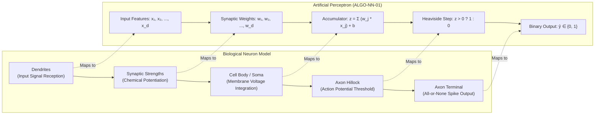
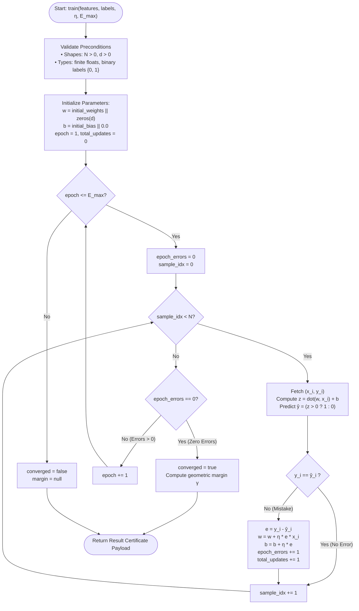
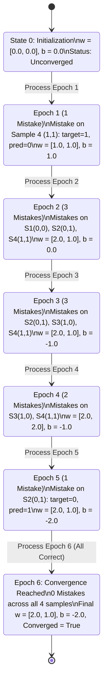
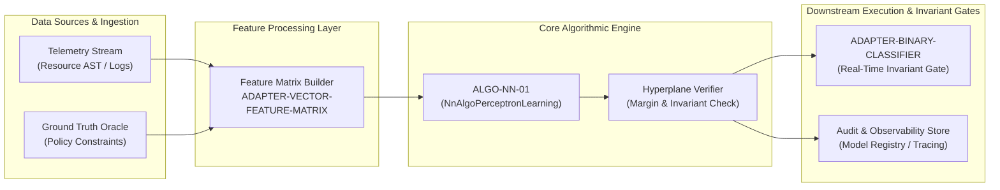

# Perceptron Mistake-Driven Learning Rule (ALGO-NN-01)

> **ID:** ALGO-NN-01  
> **Summary:** The fundamental single-neuron linear threshold classifier that iteratively learns separating hyperplanes via mistake-driven parameter updates.

---

## 1. Formal Mathematical Formulation & Definitions

The **Perceptron** is a linear binary classification model that maps an input feature vector $\mathbf{x} \in \mathbb{R}^d$ to a discrete binary label $\hat{y} \in \{0, 1\}$ using a learned weight vector $\mathbf{w} \in \mathbb{R}^d$ and a scalar bias $b \in \mathbb{R}$.

### Mathematical Formulation

Given a training dataset $\mathcal{D} = \{(\mathbf{x}_i, y_i)\}_{i=1}^N$ where $\mathbf{x}_i \in \mathbb{R}^d$ and $y_i \in \{0, 1\}$:

1. **Affine Activation Function:**
   $$z = \mathbf{w}^\top \mathbf{x} + b = \sum_{j=1}^d w_j x_j + b$$

2. **Heaviside Step Decision Rule:**
   $$\hat{y} = f(z) = \begin{cases} 1 & \text{if } z > 0 \\ 0 & \text{if } z \le 0 \end{cases}$$

3. **Mistake-Driven Parameter Update Rule:**
   For a sample $(\mathbf{x}_i, y_i)$, let error $e_i = y_i - \hat{y}_i \in \{-1, 0, +1\}$. When $e_i \neq 0$, parameters are updated with learning rate $\eta > 0$:
   $$\mathbf{w}^{(t+1)} = \mathbf{w}^{(t)} + \eta (y_i - \hat{y}_i) \mathbf{x}_i$$
   $$b^{(t+1)} = b^{(t)} + \eta (y_i - \hat{y}_i)$$

4. **Separating Hyperplane & Geometric Margin:**
   The decision boundary is defined by the affine hyperplane:
   $$\mathcal{H} = \{\mathbf{x} \in \mathbb{R}^d \mid \mathbf{w}^\top \mathbf{x} + b = 0\}$$
   When the training set is linearly separable and the algorithm converges, the geometric margin $\gamma$ is:
   $$\gamma = \min_{i \in \{1, \dots, N\}} \frac{(2y_i - 1)(\mathbf{w}^\top \mathbf{x}_i + b)}{\|\mathbf{w}\|_2}$$

### Formal Definitions

| Concept | Mathematical Symbol | Formal Definition | Operational Role |
|---|---|---|---|
| **Input Feature Vector** | $\mathbf{x} \in \mathbb{R}^d$ | Ordered $d$-dimensional coordinate vector in Euclidean space. | Encodes numerical sample attributes. |
| **Weight Vector** | $\mathbf{w} \in \mathbb{R}^d$ | Normal vector defining the orientation of the separating hyperplane. | Determines relative feature influence. |
| **Bias Term** | $b \in \mathbb{R}$ | Scalar intercept translating the hyperplane relative to the origin. | Sets the unconditioned activation threshold. |
| **Linear Activation** | $z \in \mathbb{R}$ | Inner product $z = \langle \mathbf{w}, \mathbf{x} \rangle + b$. | Continuous signed distance metric to boundary. |
| **Prediction Error** | $e_i \in \{-1, 0, +1\}$ | Algebraic difference $e_i = y_i - \hat{y}_i$. | Direct gradient surrogate triggering parameter updates. |
| **Learning Rate** | $\eta \in \mathbb{R}_{>0}$ | Scalar multiplier scaling each parameter adjustment step. | Controls mistake step magnitude. |
| **Epoch** | $E \in \mathbb{N}_{\ge 1}$ | Complete sequential traversal over all $N$ training instances. | Outer iteration unit of the optimization loop. |
| **Linear Separability** | — | Existence of $(\mathbf{w}^*, b^*)$ such that $(2y_i - 1)(\mathbf{w}^{*\top} \mathbf{x}_i + b^*) > 0 \;\forall i$. | Necessary condition for guaranteed convergence. |

---

## 2. Biological Neuron vs. Artificial Perceptron Architecture



*Figure 1: Architectural equivalence between biological neuron components and the artificial perceptron formulation.*

---

## 3. When to Use / When NOT to Use

### When to Use
- **Linearly Separable Binary Classification:** When data classes can be strictly partitioned by a linear hyperplane.
- **Ultra-Low Latency Edge Inference:** Executable with minimal CPU scalar instructions (inner products and branch checks).
- **Online and Streaming Mistake-Driven Learning:** Operates in $O(d)$ auxiliary memory without storing historical minibatches or computing Hessian/covariance matrices.
- **Deterministic Baseline Generation:** Fast $O(E \cdot N \cdot d)$ sanity check before deploying deep neural networks or kernel methods.

### When NOT to Use
- **Non-Linearly Separable Topologies (e.g., XOR Problem):** The perceptron will not converge and will cycle indefinitely unless bounded by `max_epochs`. Use Multilayer Perceptron (ALGO-NN-02) or kernelized classifiers.
- **Probabilistic Calibration Required:** Outputs discrete step predictions $\{0, 1\}$ without posterior probability estimates. Use Logistic Regression.
- **Noisy Labels / Overlapping Class Distributions:** Stochastic label noise causes continuous hyperplane oscillations. Use Soft-Margin SVM or cross-entropy gradient descent.

---

## 4. Step-by-Step Execution Procedure

1. **Parameter Initialization:** Initialize weight vector $\mathbf{w} \leftarrow \mathbf{w}_0$ (default $\mathbf{0} \in \mathbb{R}^d$) and bias $b \leftarrow b_0$ (default $0.0$).
2. **Epoch Traversal:** For each epoch $e \in \{1, \dots, E_{\text{max}}\}$:
   - Reset epoch error counter: $\text{epoch\_errors} \leftarrow 0$.
   - For each training instance $(\mathbf{x}_i, y_i) \in \mathcal{D}$:
     1. Compute linear activation: $z_i = \mathbf{w}^\top \mathbf{x}_i + b$.
     2. Evaluate step threshold: $\hat{y}_i = \mathbb{I}(z_i > 0)$.
     3. Compute error residual: $e_i = y_i - \hat{y}_i$.
     4. If $e_i \neq 0$:
        - Update weights: $\mathbf{w} \leftarrow \mathbf{w} + \eta \cdot e_i \cdot \mathbf{x}_i$.
        - Update bias: $b \leftarrow b + \eta \cdot e_i$.
        - Increment $\text{total\_updates} \leftarrow \text{total\_updates} + 1$ and $\text{epoch\_errors} \leftarrow \text{epoch\_errors} + 1$.
   - **Convergence Check:** If $\text{epoch\_errors} = 0$, set $\text{converged} \leftarrow \textbf{true}$ and terminate epoch loop.
3. **Margin Certification:** If converged and $\|\mathbf{w}\|_2 > 0$, compute signed geometric margin $\gamma = \min_i \frac{(2y_i - 1)(\mathbf{w}^\top \mathbf{x}_i + b)}{\|\mathbf{w}\|_2}$.
4. **Result Packaging:** Return learned parameters $(\mathbf{w}, b)$, convergence boolean, update counters, and certificate margin.

---

## 5. Control Flow Diagram



*Figure 2: Complete control flow of the mistake-driven Perceptron training and certification lifecycle.*

---

## 6. State Over Worked Example (Logical AND)



*Figure 3: Numerical parameter trajectory across 6 training epochs on the canonical Logical AND dataset.*

---

## 7. Architecture & System Composition



*Figure 4: End-to-end architectural pipeline integrating the Perceptron engine into system observability and verification workflows.*

---

## 8. Worked Example (Test Vector)

Canonical 2D Logical AND dataset with 4 samples:
- Sample 1: features `[0.0, 0.0]` with label `0`
- Sample 2: features `[0.0, 1.0]` with label `0`
- Sample 3: features `[1.0, 0.0]` with label `0`
- Sample 4: features `[1.0, 1.0]` with label `1`

### Input JSON
```json
{
  "features": [
    [0.0, 0.0],
    [0.0, 1.0],
    [1.0, 0.0],
    [1.0, 1.0]
  ],
  "labels": [0, 0, 0, 1],
  "learning_rate": 1.0,
  "max_epochs": 10,
  "initial_weights": [0.0, 0.0],
  "initial_bias": 0.0
}
```

### Expected Output JSON
```json
{
  "weights": [2.0, 1.0],
  "bias": -2.0,
  "converged": true,
  "epochs_trained": 6,
  "total_updates": 10,
  "final_error_count": 0,
  "margin": 0.0
}
```

---

## 9. Edge-Case Test Vectors

### Vector 1: Empty Features (Precondition Violation)
- **Input:** `{"features": [], "labels": []}`
- **Result:** `ValueError("Precondition failed: len(input.features) > 0")`

### Vector 2: Non-Separable XOR Problem (Bounded Epoch Limit)
- **Input:**
  ```json
  {
    "features": [[0.0, 0.0], [0.0, 1.0], [1.0, 0.0], [1.0, 1.0]],
    "labels": [0, 1, 1, 0],
    "learning_rate": 1.0,
    "max_epochs": 10
  }
  ```
- **Output:**
  ```json
  {
    "weights": [-1.0, 0.0],
    "bias": 1.0,
    "converged": false,
    "epochs_trained": 10,
    "total_updates": 37,
    "final_error_count": 4,
    "margin": null
  }
  ```

### Vector 3: Single Positive Sample
- **Input:**
  ```json
  {
    "features": [[1.0, 2.0]],
    "labels": [1],
    "learning_rate": 1.0,
    "max_epochs": 5
  }
  ```
- **Output:**
  ```json
  {
    "weights": [1.0, 2.0],
    "bias": 1.0,
    "converged": true,
    "epochs_trained": 2,
    "total_updates": 1,
    "final_error_count": 0,
    "margin": 2.6832815729997477
  }
  ```

### Vector 4: Dimension Mismatch (Precondition Violation)
- **Input:** `{"features": [[1.0, 2.0], [1.0]], "labels": [1, 0]}`
- **Result:** `ValueError("Precondition failed: all(len(row) == len(input.features[0])) (row 1 length 1 != 2)")`

---

## 10. Complexity Table

| Metric | Complexity | Description / Variables |
|---|---|---|
| **Time (Worst Case)** | $O(E_{\text{max}} \cdot N \cdot d)$ | $N$ samples, $d$ dimensions, $E_{\text{max}}$ maximum epochs |
| **Time (Typical Case)**| $O(E^* \cdot N \cdot d)$ | $E^* \le E_{\text{max}}$ epochs until convergence |
| **Space (Auxiliary)** | $O(d)$ | Stores weight vector of size $d$ and scalar bias |

---

## 11. Contract Summary

| Contract Field | Value | Rationale |
|---|---|---|
| `algo_id` | `ALGO-NN-01` | Unique registry taxonomy key |
| `purity` | `pure` | Function of inputs only; no external lookups |
| `determinism` | `deterministic` | Ordered sequential updates produce identical results |
| `idempotency` | `idempotent` | Re-running on identical inputs yields identical parameters |
| `reversibility` | `not_applicable` | In-memory compute; no external persistence side effects |
| `side_effects` | `none` | Zero I/O, zero global mutations, zero logging |
| `concurrency_model` | `thread_safe` | Static method with strictly local activation state |
| `hardware_target` | `cpu_scalar` | Standard scalar floating-point instructions |
| `exactness` | `exact` | Exact zero-loss hyperplane on linearly separable inputs |

---

## 12. Failure Modes and Guardrails

1. **Non-Separable Infinite Loops:** Non-separable datasets cause cycling. **Guardrail:** The `max_epochs` parameter strictly terminates training, returning `converged = False`.
2. **Floating-Point Overflow / Underflow:** Feature vectors with extreme coordinate magnitudes can trigger numerical overflow during dot product summation. **Guardrail:** Validate finite numeric types and scale feature matrices prior to training.
3. **Zero Margin on Decision Boundary:** Samples that fall precisely on the zero activation threshold are assigned label 0 by convention. **Guardrail:** The certificate verifier checks signed margins explicitly.

---

## 13. Verification & Certificate

To independently certify the output when `converged` is True:
1. Verify that the length of the weights array equals the feature dimension $d$ and the bias is a finite number.
2. For each sample index $i$ from $0$ to $N - 1$:
   - Compute the activation: $\text{dot\_product}(\mathbf{w}, \mathbf{x}_i) + b$.
   - If target label is $1$, verify activation is strictly greater than $0$.
   - If target label is $0$, verify activation is less than or equal to $0$.
3. If all $N$ samples satisfy this condition, the parameters represent a valid separating hyperplane and the certificate is verified.

---

## 14. References

- **Rosenblatt (1958):** F. Rosenblatt, "The Perceptron: A probabilistic model for information storage and organization in the brain," Psychological Review, 65(6):386-408, 1958. DOI: 10.1037/h0042519.
- **Novikoff (1962):** A. B. J. Novikoff, "On convergence proofs on perceptrons," Proceedings of the Symposium on the Mathematical Theory of Automata, 12:615-622, 1962.
- **Minsky & Papert (1969):** M. Minsky and S. A. Papert, Perceptrons: An Introduction to Computational Geometry, MIT Press, 1969. ISBN: 978-0262630221.
