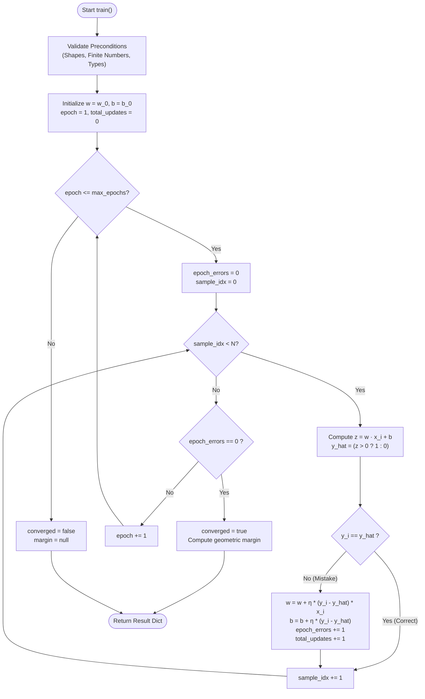
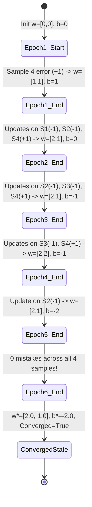
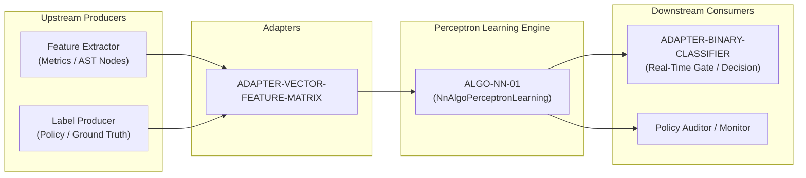

# Perceptron Mistake-Driven Learning Rule (ALGO-NN-01)

> **ID:** `ALGO-NN-01`  
> **Summary:** The fundamental single-neuron linear classifier that iteratively learns separating hyperplanes via mistake-driven parameter updates.

---

## 1. What It Does

The Perceptron learning rule trains a single-layer artificial neuron to linearly separate binary data into two classes. It processes training instances sequentially, computing a dot-product activation and thresholding to produce predictions. Whenever a prediction disagrees with the ground-truth label, the algorithm adjusts the weight vector and bias in the direction of the error, terminating when zero mistakes occur across a full epoch or when the epoch budget is exhausted.

---

## 2. When to Use & When NOT to Use

### When to Use
- **Linearly Separable Binary Classification:** When data classes can be completely separated by a flat linear hyperplane.
- **Ultra-Low Memory Embedded & Edge Environments:** When model weights must fit in tiny memory footprints ($O(d)$ space) with $O(d)$ compute per sample.
- **Online & Streaming Mistake-Driven Learning:** When sample-by-sample corrections are desired without storing historical batches or computing second-order Hessian matrices.
- **Fast Baseline Generation:** As a minimal-complexity baseline before evaluating deep neural architectures or kernel machines.

### When NOT to Use
- **Non-Linearly Separable Data (e.g. XOR):** The Perceptron will never converge and will cycle perpetually. Use a **Multilayer Perceptron (MLP)** (`ALGO-NN-02`) or **Support Vector Machine with RBF Kernel** (`ALGO-CLASSICAL-ML-02`).
- **Probabilistic Calibration Required:** The Perceptron outputs hard step decisions ($0$ or $1$) without posterior class probabilities. Use **Logistic Regression** (`ALGO-CLASSICAL-ML-01`).
- **Noisy Labels / Overlapping Distributions:** Mistakes caused by noise cause persistent weight oscillation. Use **Soft-Margin SVM** or regularized gradient descent.

---

## 3. How It Works

1. **Initialize Parameters:** Set initial weight vector $\mathbf{w} \leftarrow \mathbf{0} \in \mathbb{R}^d$ and bias $b \leftarrow 0.0$ (or use user-supplied initial parameters).
2. **Iterate Across Epochs:** For each epoch $e \in \{1, \dots, E_{\max}\}$, reset the epoch mistake counter to $0$.
3. **Compute Linear Activation:** For each training sample $(\mathbf{x}_i, y_i)$, calculate inner product activation $z = \mathbf{w} \cdot \mathbf{x}_i + b = \sum_{j=1}^d w_j x_{ij} + b$.
4. **Evaluate Decision Threshold:** Compute predicted label $\hat{y}_i = 1$ if $z > 0$, else $\hat{y}_i = 0$.
5. **Calculate Mistake Error:** Compute mistake delta $e_i = y_i - \hat{y}_i \in \{-1, 0, +1\}$.
6. **Apply Mistake Update:** If $e_i \ne 0$:
   - $\mathbf{w} \leftarrow \mathbf{w} + \eta \cdot e_i \cdot \mathbf{x}_i$
   - $b \leftarrow b + \eta \cdot e_i$
   - Increment total updates and epoch error counter.
7. **Check Epoch Convergence:** If an epoch completes with $0$ errors, mark `converged = True` and exit early.
8. **Compute Verification Margin:** If converged and $\|\mathbf{w}\|_2 > 0$, calculate geometric margin $\gamma = \min_i \frac{(2y_i - 1)(\mathbf{w} \cdot \mathbf{x}_i + b)}{\|\mathbf{w}\|_2}$.

---

## 4. Diagram 1 — Control Flow


*Figure 1: Control flow of the mistake-driven Perceptron training loop detailing epoch and sample iterations.*

---

## 5. Diagram 2 — State Over Worked Example


*Figure 2: Trajectory of weight vector $\mathbf{w}$ and bias $b$ across training epochs on the Logical AND dataset.*

---

## 6. Diagram 3 — Composition in Pipeline


*Figure 3: System integration pipeline showing upstream feature producers, adapter contracts, and downstream decision gates.*

---

## 7. Worked Example (Test Vector)

Canonical 2D Logical AND dataset with 4 samples:
- Sample 1: $[0.0, 0.0] \to 0$
- Sample 2: $[0.0, 1.0] \to 0$
- Sample 3: $[1.0, 0.0] \to 0$
- Sample 4: $[1.0, 1.0] \to 1$

### Input JSON
```json
{
  "features": [
    [0.0, 0.0],
    [0.0, 1.0],
    [1.0, 0.0],
    [1.0, 1.0]
  ],
  "labels": [0, 0, 0, 1],
  "learning_rate": 1.0,
  "max_epochs": 10,
  "initial_weights": [0.0, 0.0],
  "initial_bias": 0.0
}
```

### Expected Output JSON
```json
{
  "weights": [2.0, 1.0],
  "bias": -2.0,
  "converged": true,
  "epochs_trained": 6,
  "total_updates": 10,
  "final_error_count": 0,
  "margin": 0.0
}
```

---

## 8. Edge-Case Test Vectors

### Vector 1: Empty Features (Precondition Violation)
- **Input:** `{"features": [], "labels": []}`
- **Result:** `ValueError("Precondition failed: len(input.features) > 0")`

### Vector 2: Non-Separable XOR Problem (Bounded Epoch Limit)
- **Input:**
  ```json
  {
    "features": [[0.0, 0.0], [0.0, 1.0], [1.0, 0.0], [1.0, 1.0]],
    "labels": [0, 1, 1, 0],
    "learning_rate": 1.0,
    "max_epochs": 10
  }
  ```
- **Output:**
  ```json
  {
    "weights": [-1.0, 0.0],
    "bias": 1.0,
    "converged": false,
    "epochs_trained": 10,
    "total_updates": 37,
    "final_error_count": 4,
    "margin": null
  }
  ```

### Vector 3: Single Positive Sample
- **Input:**
  ```json
  {
    "features": [[1.0, 2.0]],
    "labels": [1],
    "learning_rate": 1.0,
    "max_epochs": 5
  }
  ```
- **Output:**
  ```json
  {
    "weights": [1.0, 2.0],
    "bias": 1.0,
    "converged": true,
    "epochs_trained": 2,
    "total_updates": 1,
    "final_error_count": 0,
    "margin": 2.6832815729997477
  }
  ```

### Vector 4: Dimension Mismatch (Precondition Violation)
- **Input:** `{"features": [[1.0, 2.0], [1.0]], "labels": [1, 0]}`
- **Result:** `ValueError("Precondition failed: all(len(row) == len(input.features[0])) (row 1 length 1 != 2)")`

---

## 9. Complexity Table

| Metric | Complexity | Description / Variables |
|---|---|---|
| **Time (Worst Case)** | $\mathcal{O}(E_{\max} \cdot N \cdot d)$ | $N$ samples, $d$ dimensions, $E_{\max}$ maximum epochs |
| **Time (Typical Case)**| $\mathcal{O}(E \cdot N \cdot d)$ | $E \le E_{\max}$ epochs until convergence |
| **Space (Auxiliary)** | $\mathcal{O}(d)$ | Stores weight vector of size $d$ and scalar bias |

---

## 10. Contract Summary

| Contract Field | Value | Rationale |
|---|---|---|
| `algo_id` | `ALGO-NN-01` | Unique registry taxonomy key |
| `purity` | `pure` | Function of inputs only; no external lookups |
| `determinism` | `deterministic` | Ordered sequential updates produce identical results |
| `idempotency` | `idempotent` | Re-running on identical inputs yields identical parameters |
| `reversibility` | `not_applicable` | In-memory compute; no external persistence side effects |
| `side_effects` | `none` | Zero I/O, zero global mutations, zero logging |
| `concurrency_model` | `thread_safe` | Static method with strictly local activation state |
| `hardware_target` | `cpu_scalar` | Standard scalar floating-point instructions |
| `exactness` | `exact` | Exact zero-loss hyperplane on linearly separable inputs |

---

## 11. Failure Modes and Guardrails

1. **Non-Separable Infinite Loops:** Non-separable datasets cause cycling. **Guardrail:** The `max_epochs` parameter strictly terminates training, returning `converged = False`.
2. **Floating-Point Overflow / Underflow:** Feature vectors with extreme coordinate magnitudes ($> 10^{100}$) can trigger numerical overflow during dot product summation. **Guardrail:** Validate finite numeric types and scale feature matrices prior to training.
3. **Zero Margin on Decision Boundary:** Samples that fall precisely on the $z=0$ hyperplane are assigned label 0 by convention. **Guardrail:** The certificate verifier checks signed margins explicitly.

---

## 12. Verification & Certificate

To independently certify the output when `converged == True`:
1. Check that `len(weights) == d` and `bias` is a finite scalar.
2. For each sample $i \in \{0, \dots, N-1\}$:
   $$\text{Compute } z_i = \sum_{j=1}^d w_j x_{ij} + b$$
   $$\text{Verify } \begin{cases} z_i > 0 & \text{if } y_i = 1 \\ z_i \le 0 & \text{if } y_i = 0 \end{cases}$$
3. If all $N$ checks pass, the hyperplane is a valid linear separator with certificate satisfied.

---

## 13. References

- **Rosenblatt (1958):** F. Rosenblatt, "The Perceptron: A probabilistic model for information storage and organization in the brain," *Psychological Review*, 65(6):386–408, 1958. [DOI: 10.1037/h0042519](https://doi.org/10.1037/h0042519).
- **Novikoff (1962):** A. B. J. Novikoff, "On convergence proofs on perceptrons," *Proceedings of the Symposium on the Mathematical Theory of Automata*, 12:615–622, 1962.
- **Minsky & Papert (1969):** M. Minsky and S. A. Papert, *Perceptrons: An Introduction to Computational Geometry*, MIT Press, 1969. [ISBN: 978-0262630221].
