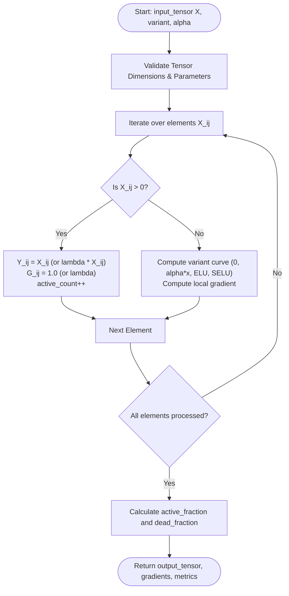
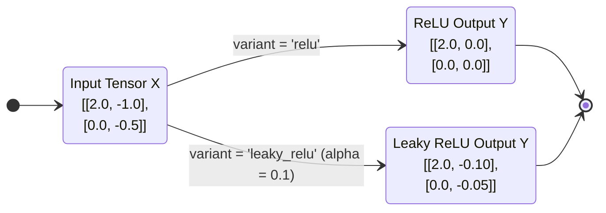
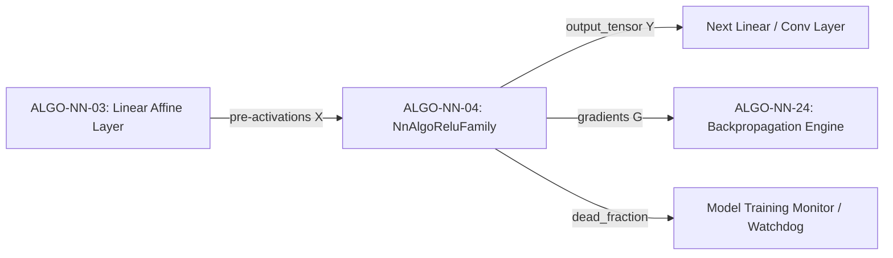

# Rectified Linear Unit (ReLU) Family Activations (ALGO-NN-04)

Component-wise non-linear activations with local subgradient computation and dead-neuron diagnostic metrics for ReLU, Leaky ReLU, PReLU, ELU, and SELU.

---

## 1. What It Does

Applies piecewise continuous activation functions across 2D pre-activation tensors, computes analytical backward derivatives $\frac{\partial \phi}{\partial x}$, and reports the fraction of active ($x > 0$) vs. dead/saturating ($x \le 0$) units.

---

## 2. When to Use / When NOT to Use

### When to Use
- **ReLU:** Default standard activation for Convolutional Neural Networks and Feedforward MLPs.
- **Leaky ReLU / PReLU:** Mitigating the dead ReLU problem in deep networks where many neurons receive negative inputs.
- **ELU / SELU:** Self-normalizing feedforward networks (SNNs) requiring mean-zero and unit-variance propagation without explicit batch normalization.

### When NOT to Use
- Autoregressive Language Models and Modern Transformers — use Smooth Activations (GELU, SwiGLU; ALGO-NN-05, ALGO-NN-08).
- Gating mechanisms requiring strictly bounded $(0, 1)$ outputs — use Sigmoid / Tanh (ALGO-NN-06).

---

## 3. How It Works

1. Validate input matrix shape $(N \times D)$ and parameter finiteness.
2. For each element $x = X_{ij}$:
   - **ReLU:** $\phi(x) = \max(0, x)$, $\phi'(x) = 1_{\{x > 0\}}$.
   - **Leaky ReLU:** $\phi(x) = \max(\alpha x, x)$, $\phi'(x) = 1$ if $x > 0$ else $\alpha$.
   - **PReLU:** $\phi(x) = \max(a_j x, x)$, with channel weight $a_j$.
   - **ELU:** $\phi(x) = x$ if $x > 0$ else $\alpha(e^x - 1)$.
   - **SELU:** $\phi(x) = \lambda x$ if $x > 0$ else $\lambda \alpha_{\text{selu}}(e^x - 1)$.
3. Track the total number of strictly positive elements to compute `active_fraction` and `dead_fraction`.
4. Return activated tensor $\mathbf{Y}$, analytical gradients $\mathbf{G}$, and sparsity metrics.

---

## 4. Control Flow Diagram



*Figure 1: Element-wise evaluation and gradient extraction flow.*

---

## 5. State Over Worked Example



*Figure 2: Numeric state transformation for standard and leaky ReLU.*

---

## 6. Architecture & Composition



*Figure 3: Pipeline composition of the ReLU family activation block.*

---

## 7. Worked Example (Test Vector)

### Input JSON
```json
{
  "input_tensor": [
    [2.0, -1.0],
    [0.0, -0.5]
  ],
  "variant": "leaky_relu",
  "alpha": 0.1
}
```

### Expected Output JSON
```json
{
  "output_tensor": [
    [2.0, -0.1],
    [0.0, -0.05]
  ],
  "gradients": [
    [1.0, 0.1],
    [0.1, 0.1]
  ],
  "active_fraction": 0.25,
  "dead_fraction": 0.75,
  "shape": [2, 2]
}
```

---

## 8. Edge-Case Test Vectors

### Edge Case 1: All Negative Tensor (Standard ReLU Dead Zone)
- **Input:** `input_tensor: [[-1.0, -2.0], [-3.0, -4.0]]`, `variant: "relu"`.
- **Output:** `output_tensor: [[0.0, 0.0], [0.0, 0.0]]`, `active_fraction: 0.0`, `dead_fraction: 1.0`.

### Edge Case 2: PReLU Channel Weights Vector
- **Input:** `input_tensor: [[-2.0, -2.0]]`, `variant: "prelu"`, `prelu_weights: [0.25, 0.50]`.
- **Output:** `output_tensor: [[-0.5, -1.0]]`, `gradients: [[0.25, 0.50]]`.

### Edge Case 3: PReLU Dimension Mismatch Error
- **Input:** `input_tensor: [[1.0, 2.0]]`, `variant: "prelu"`, `prelu_weights: [0.1]`.
- **Expected Result:** Raises `ValueError("Precondition failed: prelu_weights length 1 != expected dimension 2")`.

### Edge Case 4: Non-finite Alpha Parameter
- **Input:** `input_tensor: [[1.0]]`, `alpha: float("nan")`.
- **Expected Result:** Raises `ValueError("Precondition failed: alpha must be a finite number")`.

---

## 9. Complexity Table

| Metric | Complexity | Description |
|---|---|---|
| **Time (Worst)** | $\mathcal{O}(N \cdot D)$ | Single element-wise pass across all entries |
| **Time (Typical)** | $\mathcal{O}(N \cdot D)$ | Identical for all inputs |
| **Space** | $\mathcal{O}(N \cdot D)$ | Memory for output tensor and gradient matrix |

---

## 10. Contract Summary

| Field | Value |
|---|---|
| **Purity** | `pure` |
| **Determinism** | `deterministic` |
| **Idempotency** | `idempotent` |
| **Reversibility** | `not_applicable` |
| **Side Effects** | `none` |
| **Hardware Target** | `cpu_scalar` |
| **Exactness** | `exact` |

---

## 11. Failure Modes and Guardrails

- **Dying ReLU:** If `dead_fraction` approaches $1.0$ during training, gradient updates cease. Guardrail: switch to Leaky ReLU ($\alpha = 0.01$) or GELU.
- **Extreme Exponential Underflow:** In ELU/SELU, large negative inputs could underflow floating-point representations; clamped at $-50.0$.

---

## 12. Independent Verification

1. Verify $Y_{ij} = \max(0, X_{ij})$ for ReLU or $Y_{ij} = \max(\alpha X_{ij}, X_{ij})$ for Leaky ReLU.
2. Confirm `active_fraction + dead_fraction == 1.0`.

---

## 13. References

- Nair, V., & Hinton, G. E. (2010). Rectified linear units improve restricted Boltzmann machines. *ICML 2010*, 807–814.
- Maas, A. L., Hannun, A. Y., & Ng, A. Y. (2013). Rectifier nonlinearities improve neural network acoustic models. *ICML 2013*, 30(3).
- He, K., Zhang, X., Ren, S., & Sun, J. (2015). Delving deep into rectifiers: Surpassing human-level performance on ImageNet classification. *ICCV 2015*, 1026–1034. DOI: [10.1109/ICCV.2015.123](https://doi.org/10.1109/ICCV.2015.123).
- Clevert, D.-A., Unterthiner, T., & Hochreiter, S. (2016). Fast and accurate deep network learning by exponential linear units (ELUs). *ICLR 2016*.
- Klambauer, G., Unterthiner, T., Mayr, A., & Hochreiter, S. (2017). Self-normalizing neural networks. *NeurIPS 2017*, 971–980.
