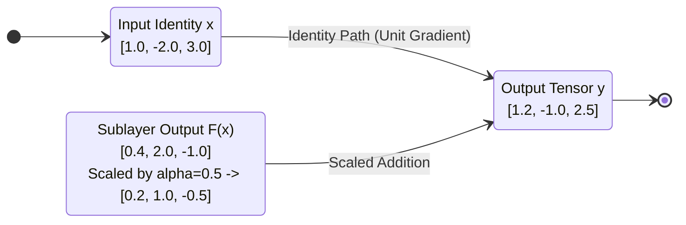

# Residual Connections and Skip Architectures (ALGO-NN-10)

Deterministic execution of residual skip connections ($\mathbf{y} = \mathbf{x} + \alpha \mathcal{F}(\mathbf{x})$) with linear projection shortcuts, branch scaling factors, and gradient highway Jacobian verification.

---

## 1. What It Does

Combines identity input features directly with sublayer transformation outputs ($x + \alpha F(x)$), computes projection shortcuts when feature dimensions change, applies branch variance scaling (DeepNorm), and verifies the non-vanishing gradient highway.

---

## 2. When to Use / When NOT to Use

### When to Use
- Every modern deep neural architecture (ResNets, Transformers, ConvNeXt, Diffusion U-Nets).
- Bypassing attention sublayers and feedforward blocks ($x + \text{Attention}(\text{LN}(x))$).
- Scaling networks beyond 100+ layers without gradient degradation.

### When NOT to Use
- Shallow architectures (1–2 layers) where direct linear or MLP mappings suffice without skip overhead.

---

## 3. How It Works

1. Validate input shapes: confirm that `identity_tensor` and `sublayer_tensor` share batch size $B$.
2. Check dimensionality:
   - If $D_{\text{in}} == D_{\text{out}}$ and no projection weights: use direct identity vector $\mathbf{x}$.
   - Else: compute projection shortcut $\mathbf{x}_{\text{proj}} = \mathbf{x} \mathbf{W}_{\text{proj}}^\top$.
3. Compute residual addition for each coordinate: $y_j = x_j + \alpha \cdot F_j(x)$ (or with learned gate weights $g_j$).
4. Return output tensor $\mathbf{Y}$, identity Jacobian $\mathbf{J}_{\text{id}}$, and projection status.

---

## 4. Control Flow Diagram

```mermaid
flowchart TD
    Start([Start: identity x, sublayer F(x), W_proj, scale alpha]) --> Validate[Validate Batch Size & Dimensions]
    Validate --> CheckDim{Does D_in == D_out and W_proj is null?}
    CheckDim -- Yes --> DirectIdentity["Shortcut vector = x<br/>Jacobian = Identity Matrix I"]
    CheckDim -- No --> ProjShortcut["Compute projection shortcut:<br/>Shortcut vector = x * W_proj^T<br/>Jacobian = W_proj"]
    DirectIdentity --> AddResidual["Add residual branch:<br/>y = Shortcut + alpha * F(x)"]
    ProjShortcut --> AddResidual
    AddResidual --> Return([Return output_tensor y, jacobian, has_projection])
```

*Figure 1: Control flow for residual addition and shortcut projection.*

---

## 5. State Over Worked Example



*Figure 2: Numeric state transformation showing residual combination.*

---

## 6. Architecture & Composition

```mermaid
flowchart LR
    InNorm[Input State x] --> SubLayer[Attention / FFN Sublayer]
    InNorm --> Skip[Identity Skip Path]
    SubLayer -->|F(x)| Res[ALGO-NN-10: NnAlgoResidualConnection]
    Skip -->|x| Res
    Res -->|y = x + F(x)| NextBlock[Next Transformer Block]
```

*Figure 3: Residual connection wiring around transformer sublayers.*

---

## 7. Worked Example (Test Vector)

### Input JSON
```json
{
  "identity_tensor": [
    [1.0, -2.0, 3.0]
  ],
  "sublayer_tensor": [
    [0.4, 2.0, -1.0]
  ],
  "scaling_factor": 0.5,
  "topology": "scaled_add"
}
```

### Expected Output JSON
```json
{
  "output_tensor": [
    [1.2, -1.0, 2.5]
  ],
  "identity_gradient_jacobian": [
    [1.0, 0.0, 0.0],
    [0.0, 1.0, 0.0],
    [0.0, 0.0, 1.0]
  ],
  "has_projection": false,
  "batch_size": 1,
  "feature_dim": 3
}
```

---

## 8. Edge-Case Test Vectors

### Edge Case 1: Projection Shortcut with Dimension Change ($D_{\text{in}} = 2 \to D_{\text{out}} = 3$)
- **Input:** `identity_tensor: [[1.0, 2.0]]`, `sublayer_tensor: [[0.5, 0.5, 0.5]]`, `projection_weights: [[1.0, 0.0], [0.0, 1.0], [1.0, 1.0]]`.
- **Output:** `output_tensor: [[1.5, 2.5, 3.5]]`, `has_projection: true`.

### Edge Case 2: Gated Residual Topology
- **Input:** `identity_tensor: [[1.0, 1.0]]`, `sublayer_tensor: [[2.0, 2.0]]`, `topology: "gated_residual"`, `gate_weights: [0.1, 0.5]`.
- **Output:** `output_tensor: [[1.2, 2.0]]`.

### Edge Case 3: Missing Projection Weights on Dimension Mismatch
- **Input:** `identity_tensor: [[1.0, 2.0]]`, `sublayer_tensor: [[1.0, 2.0, 3.0]]`, `projection_weights: null`.
- **Expected Result:** Raises `ValueError("Precondition failed: dimension mismatch d_in=2 != d_out=3 requires projection_weights")`.

### Edge Case 4: Non-finite Scaling Factor
- **Input:** `identity_tensor: [[1.0]]`, `sublayer_tensor: [[1.0]]`, `scaling_factor: float("nan")`.
- **Expected Result:** Raises `ValueError("Precondition failed: input.scaling_factor > 0.0 and finite")`.

---

## 9. Complexity Table

| Metric | Complexity | Description |
|---|---|---|
| **Time (Worst)** | $\mathcal{O}(B \cdot D_{\text{out}} \cdot D_{\text{in}})$ | Projection matrix-vector multiply (if projected) |
| **Time (Typical)** | $\mathcal{O}(B \cdot D_{\text{out}})$ | Standard element-wise addition (without projection) |
| **Space** | $\mathcal{O}(B \cdot D_{\text{out}})$ | Output residual tensor |

---

## 10. Contract Summary

| Field | Value |
|---|---|
| **Purity** | `pure` |
| **Determinism** | `deterministic` |
| **Idempotency** | `idempotent` |
| **Reversibility** | `not_applicable` |
| **Side Effects** | `none` |
| **Hardware Target** | `cpu_scalar` |
| **Exactness** | `exact` |

---

## 11. Failure Modes and Guardrails

- **Uncontrolled Variance Explosion:** Adding $x + F(x)$ across 100+ layers without scaling causes activation magnitude explosion. Guardrail: use Pre-LayerNorm topology or branch scaling $\alpha = 1/\sqrt{2}$.
- **Dimension Inconsistency:** Verified strictly before addition; requires explicit projection weights if input and output dimensions differ.

---

## 12. Independent Verification

1. Verify $y_j = x_j + \alpha F_j(x)$ for each coordinate.
2. Confirm identity Jacobian is $\mathbf{I}$ when no projection is applied.

---

## 13. References

- He, K., Zhang, X., Ren, S., & Sun, J. (2016). Deep residual learning for image recognition. *CVPR 2016*, 770–778. DOI: [10.1109/CVPR.2016.90](https://doi.org/10.1109/CVPR.2016.90).
- He, K., Zhang, X., Ren, S., & Sun, J. (2016). Identity mappings in deep residual networks. *ECCV 2016*, 630–645. DOI: [10.1007/978-3-319-46493-0_38](https://doi.org/10.1007/978-3-319-46493-0_38).
- Wang, H., Ma, S., Dong, L., et al. (2023). DeepNet: Scaling transformers to 1,000 layers. *IEEE TPAMI 2023*. DOI: [10.1109/TPAMI.2023.3325608](https://doi.org/10.1109/TPAMI.2023.3325608).
