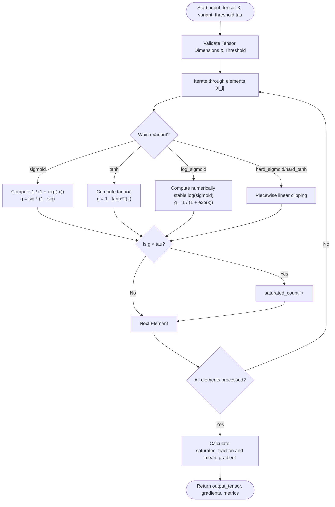
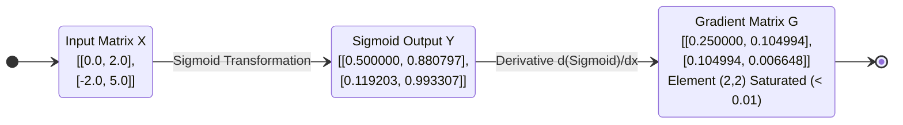
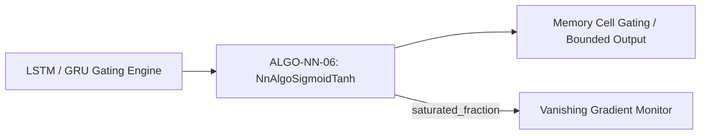

# Sigmoid and Tanh Activations with Saturation Diagnostics (ALGO-NN-06)

Deterministic evaluation of S-shaped bounded activations (Sigmoid, Tanh, Log-Sigmoid, Hard-Sigmoid, Hard-Tanh) with local gradient computation and vanishing gradient saturation tracking.

---

## 1. What It Does

Evaluates inputs through bounded monotonic curves mapping to $(0, 1)$ or $(-1, 1)$, computes exact analytical derivatives $\frac{\partial \phi}{\partial x}$, and tracks the fraction of saturated units suffering from vanishing gradients.

---

## 2. When to Use / When NOT to Use

### When to Use
- **Sigmoid:** Binary classification output probabilities, gate activations in LSTM/GRU recurrent units, and attention score gating.
- **Tanh:** Bounded hidden representation states and recurrent hidden-to-hidden transitions centered at zero.
- **Log-Sigmoid:** Binary cross-entropy losses and numerically stable log-likelihood computations.

### When NOT to Use
- Intermediate layers of deep feedforward networks or deep transformers — causes vanishing gradients (Theorem 2); use ReLU or Smooth Activations instead (ALGO-NN-04, ALGO-NN-05).

---

## 3. How It Works

1. Validate input matrix shape $(N \times D)$ and numerical finiteness.
2. For each element $x = X_{ij}$:
   - **Sigmoid:** $\sigma(x) = \frac{1}{1 + e^{-x}}$, $\sigma'(x) = \sigma(x)(1 - \sigma(x))$.
   - **Tanh:** $\tanh(x) = \frac{e^x - e^{-x}}{e^x + e^{-x}}$, $\tanh'(x) = 1 - \tanh^2(x)$.
   - **Log-Sigmoid:** $\ln(\sigma(x))$ evaluated via stable branches ($-\ln(1 + e^{-x})$ for $x \ge 0$, $x - \ln(1 + e^x)$ for $x < 0$).
   - **Hard Sigmoid:** $\text{clip}(0.2x + 0.5, 0, 1)$.
   - **Hard Tanh:** $\text{clip}(x, -1, 1)$.
3. If $|\text{gradient}| < \tau$, increment the saturation counter.
4. Return activated tensor $\mathbf{Y}$, gradient tensor $\mathbf{G}$, `saturated_fraction`, and `mean_gradient`.

---

## 4. Control Flow Diagram



*Figure 1: Element-wise evaluation, derivative computation, and saturation diagnostics.*

---

## 5. State Over Worked Example



*Figure 2: Numeric state transformation showing saturation on extreme value $x=5.0$.*

---

## 6. Architecture & Composition



*Figure 3: Pipeline composition of Sigmoid/Tanh in recurrent gating architectures.*

---

## 7. Worked Example (Test Vector)

### Input JSON
```json
{
  "input_tensor": [
    [0.0, 2.0],
    [-2.0, 5.0]
  ],
  "variant": "sigmoid",
  "saturation_threshold": 0.01
}
```

### Expected Output JSON
```json
{
  "output_tensor": [
    [0.5, 0.8807970779778823],
    [0.11920292202211755, 0.9933071490757153]
  ],
  "gradients": [
    [0.25, 0.1049935854035065],
    [0.10499358540350662, 0.00664805667079015]
  ],
  "saturated_fraction": 0.25,
  "mean_gradient": 0.11665880686945082,
  "shape": [2, 2]
}
```

---

## 8. Edge-Case Test Vectors

### Edge Case 1: Tanh on Zero Input (Maximal Derivative)
- **Input:** `input_tensor: [[0.0]]`, `variant: "tanh"`.
- **Output:** `output_tensor: [[0.0]]`, `gradients: [[1.0]]`, `saturated_fraction: 0.0`.

### Edge Case 2: Extreme Negative Input in Log-Sigmoid
- **Input:** `input_tensor: [[-100.0]]`, `variant: "log_sigmoid"`.
- **Output:** `output_tensor: [[-100.0]]`, `gradients: [[0.0]]`, `saturated_fraction: 1.0`.

### Edge Case 3: Hard Sigmoid Boundary Clipping
- **Input:** `input_tensor: [[-5.0, 5.0]]`, `variant: "hard_sigmoid"`.
- **Output:** `output_tensor: [[0.0, 1.0]]`, `gradients: [[0.0, 0.0]]`, `saturated_fraction: 1.0`.

### Edge Case 4: Invalid Non-Positive Saturation Threshold
- **Input:** `input_tensor: [[1.0]]`, `saturation_threshold: 0.0`.
- **Expected Result:** Raises `ValueError("Precondition failed: input.saturation_threshold > 0.0 and finite")`.

---

## 9. Complexity Table

| Metric | Complexity | Description |
|---|---|---|
| **Time (Worst)** | $\mathcal{O}(N \cdot D)$ | Element-wise single-pass evaluation |
| **Time (Typical)** | $\mathcal{O}(N \cdot D)$ | Uniform transcendental cost across all elements |
| **Space** | $\mathcal{O}(N \cdot D)$ | Output activations and analytical gradient matrix |

---

## 10. Contract Summary

| Field | Value |
|---|---|
| **Purity** | `pure` |
| **Determinism** | `deterministic` |
| **Idempotency** | `idempotent` |
| **Reversibility** | `not_applicable` |
| **Side Effects** | `none` |
| **Hardware Target** | `cpu_scalar` |
| **Exactness** | `exact` |

---

## 11. Failure Modes and Guardrails

- **Vanishing Gradients in Deep Stacks:** When `saturated_fraction` is high, backpropagated gradients decay exponentially as $\mathcal{O}(4^{-L})$. Guardrail: restrict Sigmoid/Tanh to gates and output probabilities.
- **Log-Sigmoid Precision Loss:** Stabilized using $x - \text{log1p}(e^x)$ for $x < 0$.

---

## 12. Independent Verification

1. Verify $\sigma(0.0) = 0.5$ and $\sigma'(0.0) = 0.25$.
2. Verify $\tanh(0.0) = 0.0$ and $\tanh'(0.0) = 1.0$.

---

## 13. References

- Hochreiter, S., & Schmidhuber, J. (1997). Long short-term memory. *Neural Computation*, 9(8), 1735–1780. DOI: [10.1162/neco.1997.9.8.1735](https://doi.org/10.1162/neco.1997.9.8.1735).
- LeCun, Y., Bottou, L., Orr, G. B., & Müller, K.-R. (1998). Efficient backprop. *Neural Networks: Tricks of the Trade*, 9–50. DOI: [10.1007/3-540-49430-8_2](https://doi.org/10.1007/3-540-49430-8_2).
- Glorot, X., & Bengio, Y. (2010). Understanding the difficulty of training deep feedforward neural networks. *AISTATS 2010*, 249–256.
