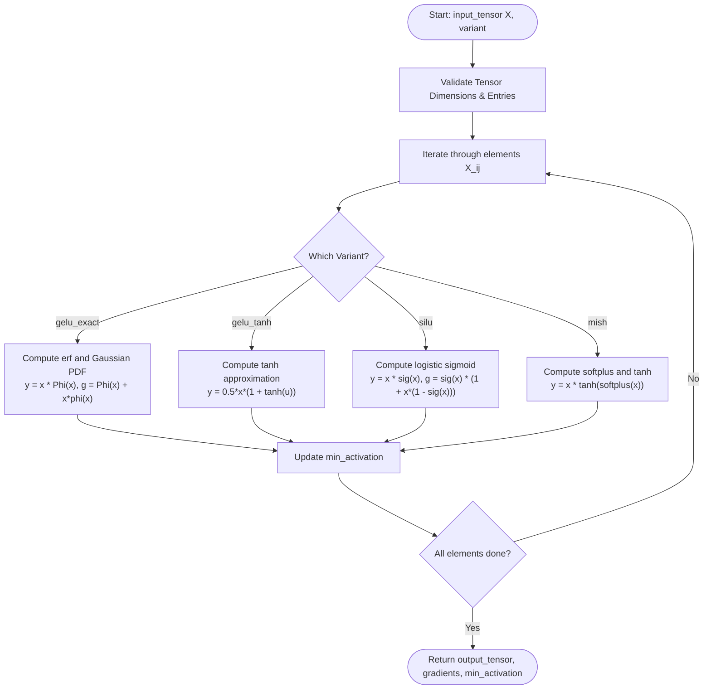
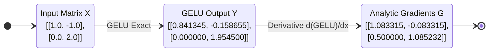
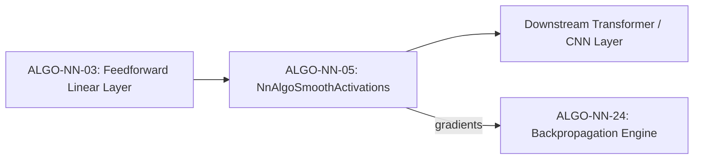

# Smooth Non-Monotonic Activations (GELU, SiLU/Swish, Mish) (ALGO-NN-05)

Deterministic computation of smooth, non-monotonic activations and exact analytic gradients for GELU (exact and fast tanh), SiLU / Swish, and Mish.

---

## 1. What It Does

Evaluates inputs through probabilistic gating and smooth curve transformations ($x \Phi(x)$, $x \sigma(x)$, $x \tanh(\text{softplus}(x))$), computing exact analytic first derivatives and tracking the non-monotonic minimum well.

---

## 2. When to Use / When NOT to Use

### When to Use
- **GELU:** Standard default activation for Transformer models (BERT, GPT, RoBERTa, LLaMA FFN).
- **SiLU (Swish):** State-of-the-art vision models (EfficientNet, ConvNeXt) and modern diffusion architectures.
- **Mish:** Deep object detection and classification architectures (YOLOv4/v7).

### When NOT to Use
- Low-latency edge devices with limited transcendental FP support — use ReLU or Leaky ReLU (ALGO-NN-04).
- Binary output gates requiring strictly bounded $(0, 1)$ outputs — use Sigmoid (ALGO-NN-06).

---

## 3. How It Works

1. Validate input matrix shape $(N \times D)$ and numerical finiteness.
2. For each element $x = X_{ij}$:
   - **GELU Exact:** $y = x \cdot \frac{1}{2}\left(1 + \text{erf}\left(\frac{x}{\sqrt{2}}\right)\right)$, $g = \Phi(x) + x \phi(x)$.
   - **GELU Tanh:** $y = 0.5 x [1 + \tanh(\sqrt{2/\pi}(x + 0.044715 x^3))]$.
   - **SiLU:** $y = x \sigma(x)$, $g = \sigma(x)[1 + x(1 - \sigma(x))]$.
   - **Mish:** $y = x \tanh(\ln(1 + e^x))$.
3. Record the minimum value across all activations to quantify the negative well.
4. Return output tensor $\mathbf{Y}$, gradient tensor $\mathbf{G}$, and minimum activation.

---

## 4. Control Flow Diagram



*Figure 1: Element-wise evaluation and gradient extraction for smooth activations.*

---

## 5. State Over Worked Example



*Figure 2: Numeric state transformation across exact GELU evaluation.*

---

## 6. Architecture & Composition



*Figure 3: Placement of smooth activations in transformer feed-forward blocks.*

---

## 7. Worked Example (Test Vector)

### Input JSON
```json
{
  "input_tensor": [
    [1.0, -1.0],
    [0.0, 2.0]
  ],
  "variant": "gelu_exact"
}
```

### Expected Output JSON
```json
{
  "output_tensor": [
    [0.8413447460685429, -0.15865525393145705],
    [0.0, 1.9544997361036415]
  ],
  "gradients": [
    [1.0833154505710603, -0.08331545057106041],
    [0.5, 1.0852319088719875]
  ],
  "min_activation": -0.15865525393145705,
  "shape": [2, 2]
}
```

---

## 8. Edge-Case Test Vectors

### Edge Case 1: Extreme Positive Input ($x = 50.0$)
- **Input:** `input_tensor: [[50.0]]`, `variant: "gelu_exact"`.
- **Output:** `output_tensor: [[50.0]]`, `gradients: [[1.0]]`, `min_activation: 50.0`.

### Edge Case 2: Extreme Negative Input ($x = -50.0$)
- **Input:** `input_tensor: [[-50.0]]`, `variant: "silu"`.
- **Output:** `output_tensor: [[0.0]]`, `gradients: [[0.0]]`, `min_activation: 0.0`.

### Edge Case 3: Mish Variant on Zero Input
- **Input:** `input_tensor: [[0.0]]`, `variant: "mish"`.
- **Output:** `output_tensor: [[0.0]]`, `gradients: [[0.6000000000000001]]` (since $\tanh(\ln(2)) \approx 0.6000$).

### Edge Case 4: Non-finite Input Tensor
- **Input:** `input_tensor: [[float("nan")]]`.
- **Expected Result:** Raises `ValueError("Precondition failed: input_tensor[0][0] is not finite (nan)")`.

---

## 9. Complexity Table

| Metric | Complexity | Description |
|---|---|---|
| **Time (Worst)** | $\mathcal{O}(N \cdot D)$ | Element-wise transcendental operations |
| **Time (Typical)** | $\mathcal{O}(N \cdot D)$ | Uniform compute cost across all values |
| **Space** | $\mathcal{O}(N \cdot D)$ | Allocates output activations and gradient tensor |

---

## 10. Contract Summary

| Field | Value |
|---|---|
| **Purity** | `pure` |
| **Determinism** | `deterministic` |
| **Idempotency** | `idempotent` |
| **Reversibility** | `not_applicable` |
| **Side Effects** | `none` |
| **Hardware Target** | `cpu_scalar` |
| **Exactness** | `exact` |

---

## 11. Failure Modes and Guardrails

- **Mish Softplus Numerical Overflow:** Direct computation of $\ln(1 + e^x)$ overflows above $x = 30$; guarded with asymptotic $x$ substitution.
- **Sigmoid Clamping:** Logistic exponentials are clamped at $|x| \ge 40$ to avoid floating-point underflow/overflow.

---

## 12. Independent Verification

1. Verify $\text{GELU}(1.0) = 1.0 \times \Phi(1.0) \approx 0.8413447$.
2. Verify $\frac{d}{dx}\text{GELU}(0.0) = \Phi(0.0) + 0 = 0.5$.

---

## 13. References

- Hendrycks, D., & Gimpel, K. (2016). Gaussian error linear units (GELUs). *arXiv preprint arXiv:1606.08415*.
- Elfwing, S., Uchibe, E., & Doya, K. (2018). Sigmoid-weighted linear units for neural network function approximation in reinforcement learning. *Neural Networks*, 107, 3–11. DOI: [10.1016/j.neunet.2018.07.019](https://doi.org/10.1016/j.neunet.2018.07.019).
- Misra, D. (2019). Mish: A self regularized non-monotonic neural activation function. *arXiv preprint arXiv:1908.08681*.
