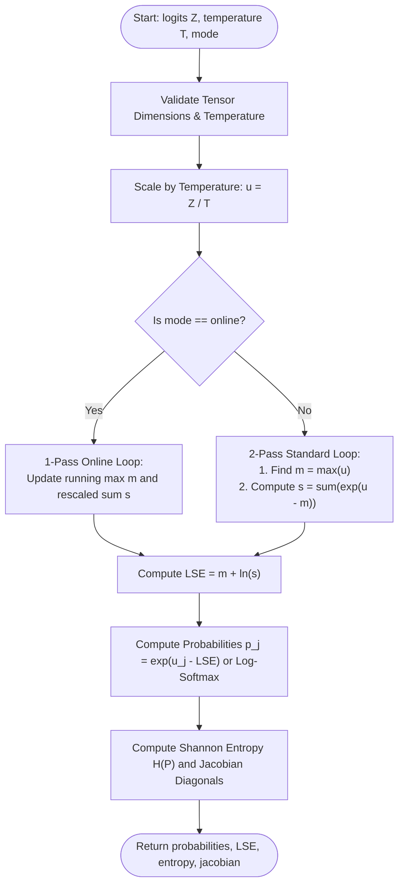
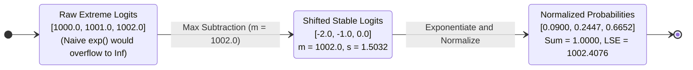

# Numerically Stable Softmax and Log-Softmax (ALGO-NN-07)

Deterministic probability normalization with Log-Sum-Exp (LSE) subtraction stabilization, temperature scaling, and one-pass online streaming algorithm.

---

## 1. What It Does

Converts arbitrary unnormalized logit vectors $\mathbf{z} \in \mathbb{R}^K$ into valid categorical probability distributions $\mathbf{p} \in \Delta^{K-1}$ or log-probabilities $\ln(\mathbf{p})$, completely eliminating IEEE 754 floating-point overflow and underflow via the translation-invariance invariant.

---

## 2. When to Use / When NOT to Use

### When to Use
- Final classification output layers for multi-class prediction and next-token prediction in Large Language Models.
- Multi-head self-attention weight normalization ($A = \text{softmax}(QK^\top / \sqrt{d_k})$).
- Cross-entropy loss computations (via `mode: "log_softmax"`).

### When NOT to Use
- Multi-label classification where classes are independent — use element-wise Sigmoid instead (ALGO-NN-06).
- Massive vocabularies ($K > 10^6$) where full softmax compute is prohibitive — use Hierarchical Softmax or Sampled Softmax.

---

## 3. How It Works

1. Scale logits by inverse temperature: $\mathbf{u} = \mathbf{z} / T$.
2. **Standard Mode:**
   - Compute row maximum: $m = \max_j u_j$.
   - Compute shifted sum of exponents: $s = \sum_{j=1}^K e^{u_j - m}$.
   - Log-Sum-Exp: $\text{LSE} = m + \ln(s)$.
   - Probabilities: $p_j = e^{u_j - \text{LSE}}$.
3. **Online Mode (FlashAttention style):**
   - Single-pass running max $m_k$ and rescaled accumulator $s_k = s_{k-1} e^{m_{k-1} - m_k} + e^{u_k - m_k}$.
4. Compute row Shannon entropy $H(P) = -\sum p_j \ln(p_j)$ and Jacobian diagonal elements $\frac{\partial p_j}{\partial z_j}$.
5. Return probabilities, LSE, entropy, and Jacobian metrics.

---

## 4. Control Flow Diagram



*Figure 1: Numerical stabilization and execution pathways for Softmax.*

---

## 5. State Over Worked Example



*Figure 2: Numerical state transformation demonstrating stable evaluation of extreme logits.*

---

## 6. Architecture & Composition

```mermaid
flowchart LR
    AttentionLogits[Attention Scores QK^T / sqrt(d)] --> Softmax[ALGO-NN-07: NnAlgoSoftmaxStable]
    Softmax --> AttentionWeights[Attention Probabilities A]
    AttentionWeights --> ValueMatMul[Value Context MatMul AV]
```

*Figure 3: Softmax integration within transformer attention heads and classification heads.*

---

## 7. Worked Example (Test Vector)

### Input JSON
```json
{
  "logits": [
    [1000.0, 1001.0, 1002.0]
  ],
  "temperature": 1.0,
  "mode": "standard_stable"
}
```

### Expected Output JSON
```json
{
  "probabilities": [
    [0.09003057317038046, 0.24472847105479767, 0.6652409557748219]
  ],
  "log_sum_exp": [
    1002.4076059644444
  ],
  "entropy": [
    0.8323961136979698
  ],
  "jacobian_diagonal": [
    [0.08192470761226786, 0.18483606622415177, 0.22269527339736853]
  ],
  "batch_size": 1,
  "num_classes": 3
}
```

---

## 8. Edge-Case Test Vectors

### Edge Case 1: High Temperature (Uniform Distribution $T \to \infty$)
- **Input:** `logits: [[0.0, 10.0]]`, `temperature: 1000.0`.
- **Output:** `probabilities: [[0.4975, 0.5025]]`, `entropy: ~0.6931 nats` ($\approx \ln(2)$).

### Edge Case 2: Low Temperature (Argmax Sharpening $T \to 0$)
- **Input:** `logits: [[1.0, 2.0]]`, `temperature: 0.01`.
- **Output:** `probabilities: [[0.0, 1.0]]`, `entropy: 0.0`.

### Edge Case 3: Log-Softmax Mode for Negative Log-Likelihood
- **Input:** `logits: [[0.0, 0.0]]`, `mode: "log_softmax"`.
- **Output:** `probabilities: [[-0.6931471805599453, -0.6931471805599453]]` ($-\ln(2)$).

### Edge Case 4: Non-Positive Temperature Error
- **Input:** `logits: [[1.0, 2.0]]`, `temperature: 0.0`.
- **Expected Result:** Raises `ValueError("Precondition failed: input.temperature > 0.0 and finite")`.

---

## 9. Complexity Table

| Metric | Complexity | Description |
|---|---|---|
| **Time (Worst)** | $\mathcal{O}(B \cdot K)$ | Exactly $3K$ operations per batch item |
| **Time (Typical)** | $\mathcal{O}(B \cdot K)$ | Identical for standard and online modes |
| **Space** | $\mathcal{O}(B \cdot K)$ | Probability matrix and diagnostic vectors |

---

## 10. Contract Summary

| Field | Value |
|---|---|
| **Purity** | `pure` |
| **Determinism** | `deterministic` |
| **Idempotency** | `idempotent` |
| **Reversibility** | `not_applicable` |
| **Side Effects** | `none` |
| **Hardware Target** | `cpu_scalar` |
| **Exactness** | `exact` |

---

## 11. Failure Modes and Guardrails

- **Logit Overflow Without Shift:** Raw $e^{1000}$ produces `inf` and `NaN`; prevented by subtracting $\max_j z_j$.
- **Log(0) in Entropy / Loss:** Guarded with direct Log-Softmax arithmetic and $10^{-30}$ floor on probability logs.

---

## 12. Independent Verification

1. Verify $\sum_j p_j = 1.0$ for any input vector.
2. Confirm translation invariance: $\mathcal{S}(\mathbf{z} + 100) == \mathcal{S}(\mathbf{z})$.

---

## 13. References

- Bridle, J. S. (1990). Probabilistic interpretation of feedforward classification network outputs, with relationships to statistical pattern recognition. *Neurocomputing*, 227–236. DOI: [10.1007/978-3-642-76153-9_28](https://doi.org/10.1007/978-3-642-76153-9_28).
- Milakov, M., & Gimelshein, N. (2018). Online normalizer calculation for softmax. *arXiv preprint arXiv:1805.02867*.
- Dao, T., Fu, D., Ermon, S., Rudra, A., & Ré, C. (2022). FlashAttention: Fast and memory-efficient exact attention with IO-awareness. *NeurIPS 2022*, 16344–16359.
